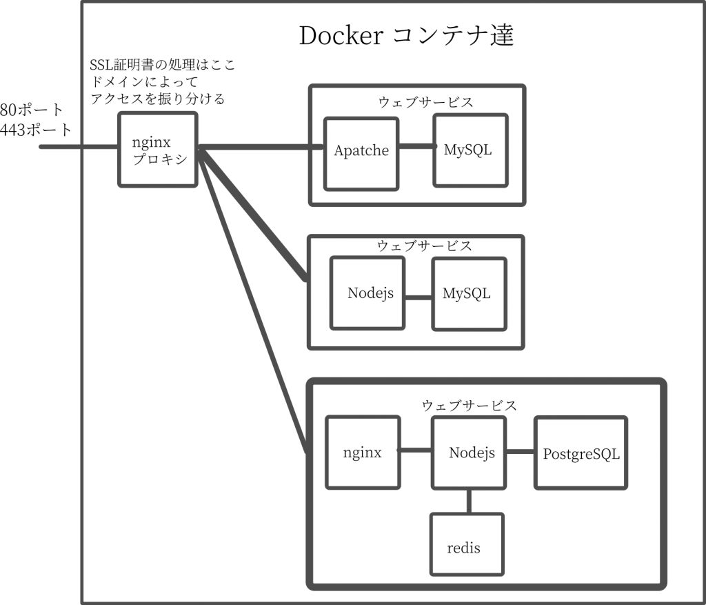

さてさて、ただいまITエンジニアの職を求めて絶賛就職活動中です。そこそこのPCスキルはあると思うのですが、いかんせん口下手のコミュ症のせいで面接で落ちてしまいます。

面接で緊張してしまうのは準備不足という点もあると思うので、一度これまでやって来たことを書いて棚卸ししてみようかと思います。自分はこんなことをやって来たとまとめておけば、面接の時にもスラスラと答えることができるようになるんじゃないかと期待しています。

## 現在の状況
就職活動中の院生

## これまでに利用してきた言語
C、C++、Java、Python、HTML、CSS、Javascript（NodeJS, React）、ShellScript

## これまでに利用してきたOS
* Windows
* Ubuntu（Desktop、Server）両方

最近はもっぱら Linux で作業することが多いです。
Linux の使用年数だけ言えば10年？初めて触ったのが Ubuntu 08.04 Netbook Remix
……Mac 欲しい

## サーバー環境
オンプレサーバー（自宅サーバー && 自作PC）
VPNサーバー（Conoha VPN）
(Azure , AWS も触りたいけど、クレジットカードを持っていないので利用できず……）

## 仮想化環境
* VirtualBox
* KVM
* LXD
* Docker

最近利用するのは殆ど Docker
LXD も軽いから好きです。
新しい Linux ディストリビューションを試すときにはKVMを利用します。
VirtualBox の出番は最近無いですね。

## 運用経験

Wordpress 2サイト: VPN鯖にDockerコンテナで構築
Mumble : ゲーマー仲間と協力プレイするため
NextCloud : 個人的なファイル管理
Minecraftサーバー : 友人とプレイするため。（毎日02:00時にバックアップを作成する自作バッチ作成。バックアップの上限は30個と指定）
Gitlab : 個人用Gitリポジトリ
OpenVPN鯖：外出先でのアクセスを安全にしたいから

## 自作ウェブアプリ：3つ

#### フラッシュGIFメーカー
[https://flashgif.ouvill.net](https://flashgif.ouvill.net)
テキストエリアに文字を入力すると文字がぱっぱと切り替わるGIFを生成するサイト。Twitterで拡散してもらうことを意識して、生成画像サイズは2:1。タイムラインで見きれることがなく、すべて表示されるようにしました。
使用技術
サーバーサイド：Docker, Nodejs
クライアントサイド：HTML , CSS, JavaScript

制作からリリースまで2日、
機能追加改修に7日
開発人数：1人

#### ブラウザ動作の縦書きエディタ
[https://zeneditor.ouvill.net](https://zeneditor.ouvill.net)
ブラウザ動作のエディタ。入力データはサーバー管理。横書きと縦書きができます。（縦書きはFirefox以外だと挙動が怪しくなります）
使用技術
サーバーサイド：Docker, Nodejs , MySQL, Oauth
クライアントサイド：HTML , CSS, JavaScript

制作からリリースまで10日
開発人数：1人

#### ディープラーニングを用いた類語検索
~~[https://word2vec.ouvill.net](https://word2vec.ouvill.net)~~ 重たいので停止

機械学習のword2vecによる類語単語。学習データは青空文庫を利用しました。文章書くときの言い換えを考えるツールが欲しかったので。

使用技術

サーバーサイド：Docker, Nodejs , MySQL, Python, DeepLearning

クライアントサイド：HTML , CSS, JavaScript, React

制作からリリースまで7日

開発人数：1人

### その他GUIアプリをちょこちょこ（昔作ったのでソースコードを何処に保存したか忘れました……）

#### 生放送用音声認識のAndroidアプリ：

昔ニコニコ生放送をしたいと思っていたときに作成したアンドロイドアプリ。Android で音声認識をして、音声認識の結果をデスクトップで起動している「棒読みちゃん」というソフトに送信するアプリ。送られてきた音声解析結果を「棒読みちゃん」が読み上げてくれるので、その音を生放送に取り込むことをしていました。

なぜ、そんなことをするかって？　自分の声をネットに流したくなかったからです。棒読み音声の生放送でした。

使用言語：Java

#### WaThunder というゲームの戦績管理アプリ
ゲーム中に誰に倒された、誰を倒したっていう情報を記録したかったので作成。ゲームの通信ログからキルログを取得して自動的に記録

使用言語：C++、GUIライブラリに Qt

### インフラとかの構築例
基本的に Docker 上で環境構築を行います。
docker & docker-compose でサーバーの構築環境を記述し、デプロイまでの負担を軽減する運用です。
図にするとこんな感じです。

ワードプレスの運用は Wordpress 用コンテナ + MySQLコンテナ
現在リリース中のNodejsアプリは Nodejsコンテナ + MySQLコンテナ
現在開発中のウェブアプリは nginxコンテナ + Nodejs コンテナ + PostgreSQL コンテナ + redisコンテナで構築中です

## 興味のある技術
* DeepLearning
* kubernetes
* Flutter

すべて分野が違うわけですが……まあ……。（DeepLearning：データサイエンス、kubernetes：ネットワークインフラ構築、Flutter：モバイルSDK）

私興味があるんです！

## 大学で学んだこと
電気電子工学。この回路に電圧をどんだけ流したら、どれほどの電流が流れるかとか。モーターのトルクは幾らとか、火力発電、水力発電の仕組みはどんなのとか。
情報系の授業もありましたが、自身のITスキルはほぼ独学

## 趣味とか
* 小説を読むこと、書くこと。海外ファンタジーが好きです。ハリポタ、指輪物語、ドラゴンランス、ダークエルフ物語。いわゆる剣と魔法の世界。
* ゲーム、特にPCゲームが好きです。ちょっとした自慢はWorld of Warship というオンラインゲームで、「神風R」という船のソロ参加試合の勝率がアジア鯖で2位であること。少し前までは1位だったのですが、今年抜かれてしまいました……。

## 資格
* 基本情報技術者
* 応用情報技術者
* 英語：英語のドキュメント読めます。最近は映画を英語音声+英語字幕で見るようにしています。テストは受けてないです……受けようかな。

## 実務経験
なし、未経験。

どこまでの作業ができたら、フロントサイドエンジニアなのか、サーバーサイドエンジニアなのか、モバイルアプリエンジニアなのかわかってません。

## 働くときの希望
自社サービスを提供しているところ（できれば創作関係や出版関係、クリエイターを支援するようなところ）
お給料いっぱい欲しい
関東 または 関西（地元が関西）

### 絶対嫌なところ
客先常駐

## まとめ
つらつらと自分のスキル等を書き出してみました。
書き出すことによって、少し自分の中で整理つきました。
面接ではしっかりと落ち着いて会話を続けていてたらいいなぁと思います。
