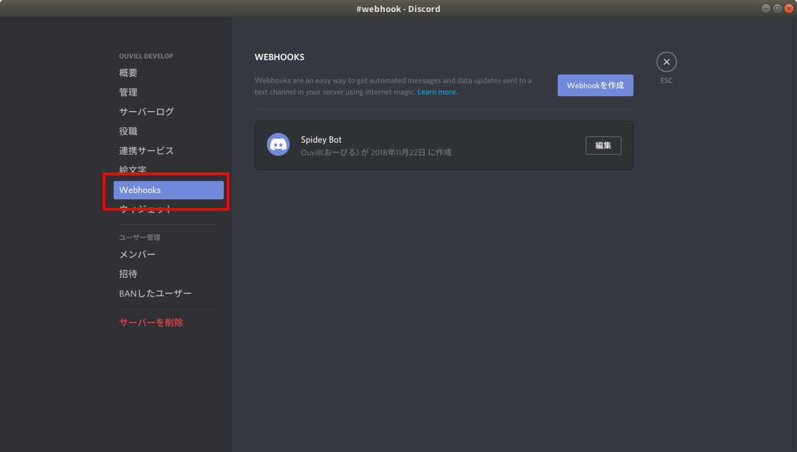
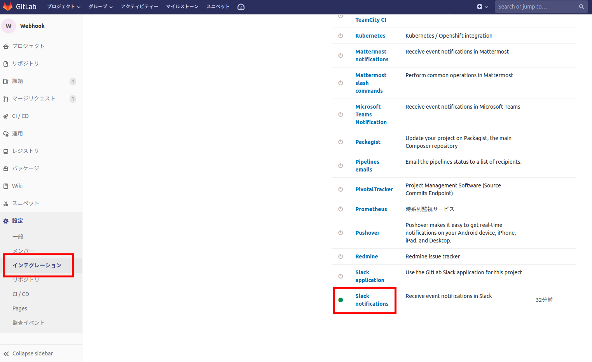
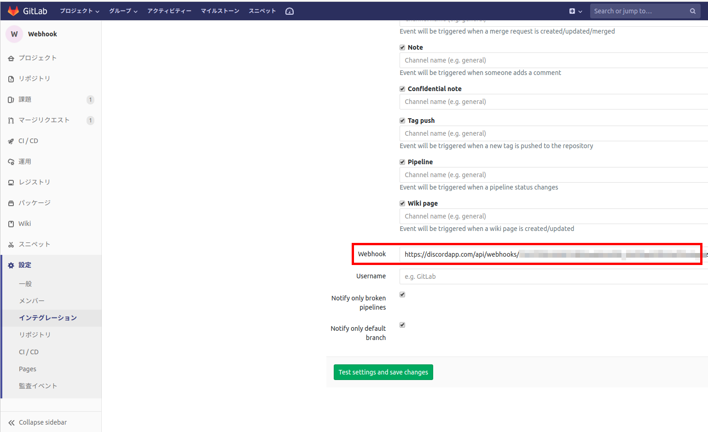

## はじめに結論

Discord から発行される WebHook URL

`/webhooks/{webhook.id}/{webhook.token}`

の末尾に `/slack` をつけ、Slack API として Gitlabに登録する

`/webhooks/{webhook.id}/{webhook.token}/slack`

## はじめに

Discord をプログラムの作成の連絡ツールに使っているという方もいらっしゃると思います。そして ソースコードは **Github** ではなく、**Gitlab** を利用しているというかたもいるでしょう。

そうしていると、Gitlab の Push イベントやビルドイベントの通知を Discord で取得したくなりませんか。

しかしながら悲しいことに、Gitlab から Discord への Webhook はそのままでは対応していません。そこで対応策としてネット検索すると、いかのような記事が出てきます。

[GitLabの通知をWebhookでDiscordに送信する](https://qiita.com/otuhs_d/items/fbb80a0bad8d0921b8e6)

https://qiita.com/otuhs_d/items/fbb80a0bad8d0921b8e6

たしかに設定を頑張れば、通知できるようになるですが、わざわざプログラムを書くのも面倒くさい。できれば、マウスポチポチすることで簡単に設定したい。

もう少し簡単な方法はないのかなと調査したら、あったのでお知らせします。

## Discord のWebHook について

まずは公式サイトで情報の確認です。以下の URL が Webhook の解説になります。

https://discordapp.com/developers/docs/resources/webhook

そこを読むと以下のような記述があります。

> Execute Slack-Compatible Webhook
>
> POST /webhooks/{webhook.id}/{webhook.token}/slack

Discord の Webhook は末尾に /slack を付加すると Slack 互換のWebhook になります。Gitlab は Slack へのWebhook は対応しているため、こちらのURLを利用することで Slack Bot として登録できるようになります。

そのことを踏まえて設定していきましょう。

## Discord のWebhook設定

「サーバー設定」-「Webhooks」からWebhookの設定をします。



Webhookを作成をクリックして、以下のとおりオプション設定をしてください。


`チャンネル`：メッセージを投稿するチャンネルの選択
`名前`：メッセージを投稿する際のユーザ名
`WEBHOOK ICON`：メッセージを投稿する際のユーザのアバターの編集

`WEBHOOK URL`  をコピーしてメモしてください。

## Gitlab の Webhook を設定

「設定」-「インテグレーション」から一番下の「Slack notifications」を選択します。



`Active` にチェックを入れて通知を有効化します。

`Trigger` でどの通知を行いたいのかチェックボックスで指定できるので指定してください。



そしてページ下部の `Webhook` に Discord から発行された `WEBHOOK URL` を記入してください。そして末尾に `/slack` を追加してください。

Discrod から発行された `WEBHOOK URL`が以下の場合

```
https://discordapp.com/api/webhooks/{webhook.id}/{webhook.token}/
```

以下のように`/slack`を追加してください。

```
https://discordapp.com/api/webhooks/{webhook.id}/{webhook.token}/slack
```

好みで`Username`を指定し、`Test settings and save changes` をクリックして設定は完了です。

正しく設定されていれば、Discord に通知が飛んでくるはずです。

お疲れ様でした。

## おわりに

「Discord は Slack 互換で動作させることができる」というのが今回の記事の肝です。最近のサービスではたいてい Slack は対応しています。おそらく、Slack互換動作のことを知っていれば、ほかの Webhook サービスも簡単に Discord に対応させることが出来ると思います。

本記事は Qiita にも投稿してあります。投稿時は本ブログが存在しなかったため、投稿場所としてQiita を利用しました。
