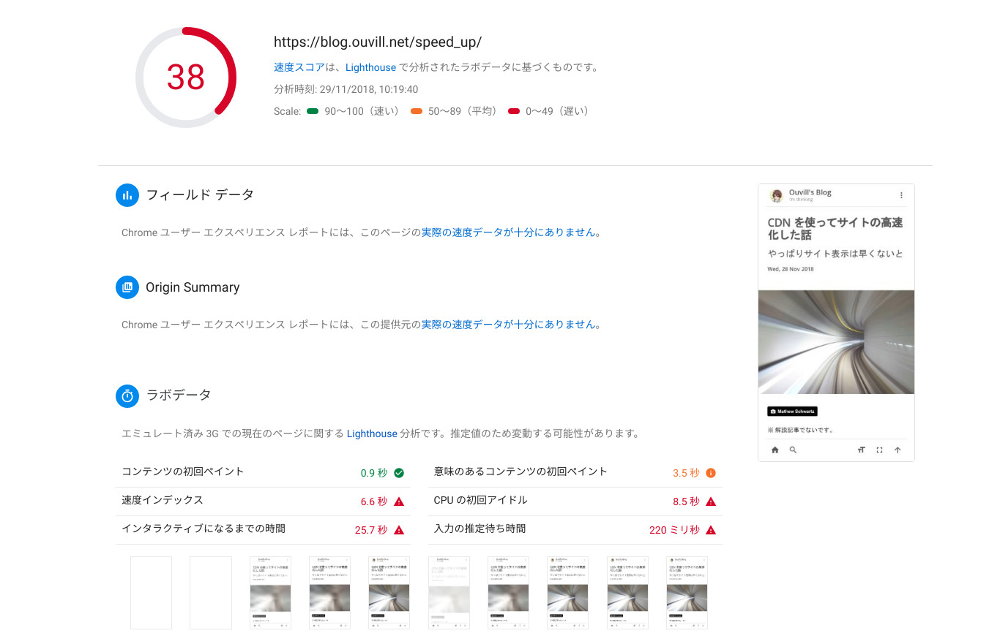
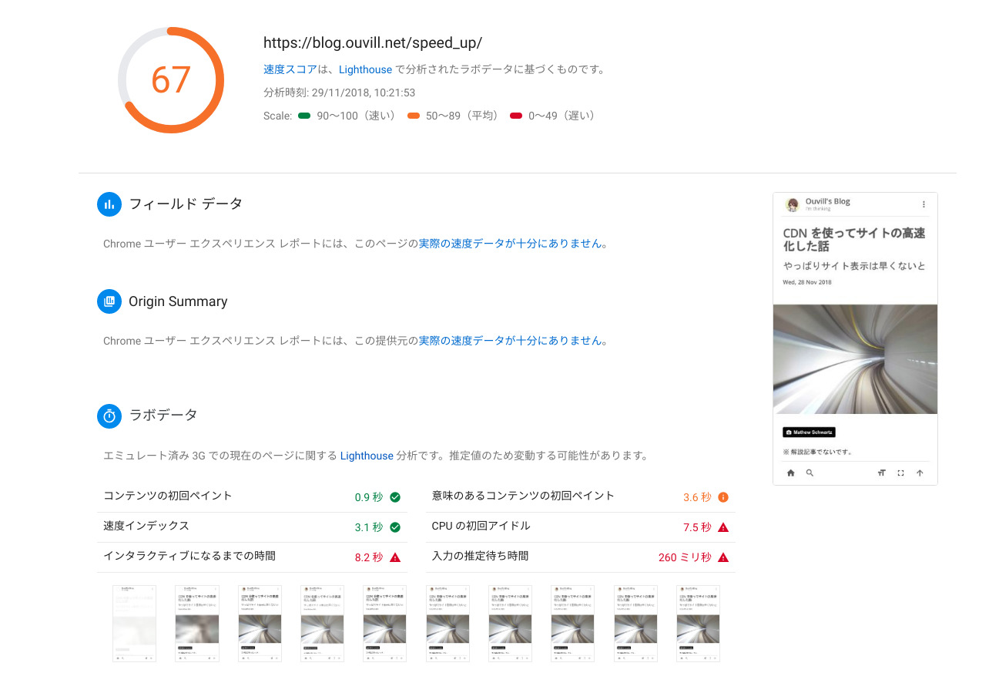

Facebook Comments plugin を無効化すると表示速度が凄く早くなった話

現在記事執筆時点（2018/11/29）、一からデザインするのは大変だったので、 [gatsby-starter-personal-blog](https://gatsby-starter-personal-blog.greglobinski.com) を利用して本ブログは構築されています。

結構デザインがキレイで気に入っているのですが、どうもサイトを速度評価してくれる Google Page Insights では評価が悪い。

どうしたものかなぁと思って解析結果を見てみると、Facebook Comments plugin が悪さをしているらしい。ならばと、Facebook コメントを綺麗サッパリ削除したら表示速度がめちゃくちゃ上がりました。

## どれくらい上がったのか

PageInsights の評価が 38 から 67 まで上がりました。ページがインタラクティブになる時間が25.7秒から8.2秒までとかなり早くなっています。もう少しページの表示速度をあげたいですが、これ以上しようと思ったらとことん改造が必要になりそうなので、一旦放置。





## Facebook Comment Plugin 無効化の方法

おそらく、Gatsby でブログ作成しようとする酔狂な人ならば自力でも解決できそうですが、一応書いておきます。

なお [gatsby-starter-personal-blog](https://gatsby-starter-personal-blog.greglobinski.com) に限った話です。

`/src/components/PostFooter` にコメントに関するコードがあります。
該当コード部分をコメントアウト、または削除してください。

```js
const PostFooter = ({ classes, author, post, slug, facebook }) => {
  return (
    <footer className={classes.footer}>
      <PostShare post={post} slug={slug} />
      <PostAuthor author={author} />
      {/* 以下をコメントアウト。例ではすでにコメントアウト済み */}
      {/* <PostComments post={post} slug={slug} facebook={facebook} />  */}
    </footer>
  );
};
```

コメントアウトしたあとは
```
gatsby build
```
して変更内容を適用してください。

## 今後

コメントシステムがなくなってしまったので、今後どうやっていこうか考える必要があります。本ブログのほうでもコメントはあまり来ないですし、コメント投稿をわざわざ有効化する必要があるのかな？　と思ってしまいます。すこし様子見ですかね。


<a style="background-color:black;color:white;text-decoration:none;padding:4px 6px;font-family:-apple-system, BlinkMacSystemFont, &quot;San Francisco&quot;, &quot;Helvetica Neue&quot;, Helvetica, Ubuntu, Roboto, Noto, &quot;Segoe UI&quot;, Arial, sans-serif;font-size:12px;font-weight:bold;line-height:1.2;display:inline-block;border-radius:3px" href="https://unsplash.com/@ninjason?utm_medium=referral&amp;utm_campaign=photographer-credit&amp;utm_content=creditBadge" target="_blank" rel="noopener noreferrer" title="Download free do whatever you want high-resolution photos from Jason Leung"><span style="display:inline-block;padding:2px 3px"><svg xmlns="http://www.w3.org/2000/svg" style="height:12px;width:auto;position:relative;vertical-align:middle;top:-1px;fill:white" viewBox="0 0 32 32"><title>unsplash-logo</title><path d="M20.8 18.1c0 2.7-2.2 4.8-4.8 4.8s-4.8-2.1-4.8-4.8c0-2.7 2.2-4.8 4.8-4.8 2.7.1 4.8 2.2 4.8 4.8zm11.2-7.4v14.9c0 2.3-1.9 4.3-4.3 4.3h-23.4c-2.4 0-4.3-1.9-4.3-4.3v-15c0-2.3 1.9-4.3 4.3-4.3h3.7l.8-2.3c.4-1.1 1.7-2 2.9-2h8.6c1.2 0 2.5.9 2.9 2l.8 2.4h3.7c2.4 0 4.3 1.9 4.3 4.3zm-8.6 7.5c0-4.1-3.3-7.5-7.5-7.5-4.1 0-7.5 3.4-7.5 7.5s3.3 7.5 7.5 7.5c4.2-.1 7.5-3.4 7.5-7.5z"></path></svg></span><span style="display:inline-block;padding:2px 3px">Jason Leung</span></a>
