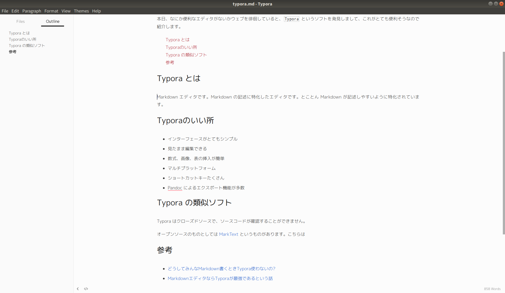

本日、なにか便利なエディタがないかウェブを徘徊していると、[Typora][] というソフトを発見しまして、これがとても便利そうなので紹介します。

## Typora とは

Markdown エディタです。Markdown の記述に特化したエディタです。とことん Markdown が記述しやすいように特化されています。

下の画面が Markdown で書いているときの様子です。プレビューモードではありません。Markdown 記法でかけばその場でスタイルが適応されるエディタです。

スクリーンショット

実際の入力画面

<video width=100% controls>
  <source src="./Typora_fast.mp4" type="video/mp4">
</video>

## Typoraのいい所

* インターフェースがとてもシンプル
* 見たまま編集できる
* 数式、画像、表の挿入が簡単
* マルチプラットフォーム（Windows、Mac、Linux で動作）
* ショートカットキーたくさん
* Pandoc によるエクスポート機能が多数
* 画面がごちゃごちゃしないので執筆に集中できる

とくにエクスポート機能は便利で、PDF、HTML、Word、LaTeX など、あらゆるフォーマットで出力可能です。吐き出されるPDFもかなりキレイな仕上がりになるので重宝できそうです。

## ダウンロード先

公式サイトからダウンロードできます。ご自身にあった バージョンを選択してください。

https://typora.io

## Typora の類似ソフト

Typora はクローズドソースで、ソースコードが確認することができません。

オープンソースのものとしては [MarkText](https://marktext.github.io/website/) というものがあります。こちらもインストールしてみましたが、[Typora][] のほうがソフトの完成度としては高いように感じました。

## Typora の類似ソフト（LaTeX）

すこし違うのですが、入力したらその場でスタイルを適応するソフトとして [LyX](https://www.lyx.org/WebJa.Home) というものがあります。これは LaTeX 記法の文書を作成するソフトです。LaTeX 記法で [Typora][] みたいなものを使いたいという人がいたらオススメします。（ニッチだなぁ）

## 参考

* [どうしてみんなMarkdown書くときTypora使わないの?](https://qiita.com/AnchorBlues/items/532dba54cd2f0465af97)
* [MarkdownエディタならTyporaが最強であるという話](http://msyksphinz.hatenablog.com/entry/2018/08/25/021047)

[Typora]: https://typora.io

<a style="background-color:black;color:white;text-decoration:none;padding:4px 6px;font-family:-apple-system, BlinkMacSystemFont, &quot;San Francisco&quot;, &quot;Helvetica Neue&quot;, Helvetica, Ubuntu, Roboto, Noto, &quot;Segoe UI&quot;, Arial, sans-serif;font-size:12px;font-weight:bold;line-height:1.2;display:inline-block;border-radius:3px" href="https://unsplash.com/@rawpixel?utm_medium=referral&amp;utm_campaign=photographer-credit&amp;utm_content=creditBadge" target="_blank" rel="noopener noreferrer" title="Download free do whatever you want high-resolution photos from rawpixel"><svg xmlns="http://www.w3.org/2000/svg" style="height:12px;width:auto;position:relative;vertical-align:middle;top:-1px;fill:white" viewBox="0 0 32 32"><title>unsplash-logo</title><path d="M20.8 18.1c0 2.7-2.2 4.8-4.8 4.8s-4.8-2.1-4.8-4.8c0-2.7 2.2-4.8 4.8-4.8 2.7.1 4.8 2.2 4.8 4.8zm11.2-7.4v14.9c0 2.3-1.9 4.3-4.3 4.3h-23.4c-2.4 0-4.3-1.9-4.3-4.3v-15c0-2.3 1.9-4.3 4.3-4.3h3.7l.8-2.3c.4-1.1 1.7-2 2.9-2h8.6c1.2 0 2.5.9 2.9 2l.8 2.4h3.7c2.4 0 4.3 1.9 4.3 4.3zm-8.6 7.5c0-4.1-3.3-7.5-7.5-7.5-4.1 0-7.5 3.4-7.5 7.5s3.3 7.5 7.5 7.5c4.2-.1 7.5-3.4 7.5-7.5z"></path></svg>rawpixel</a>
