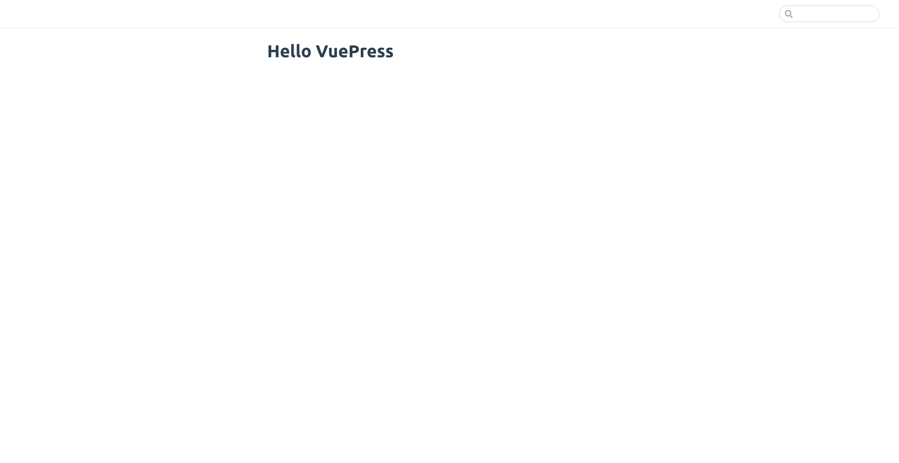
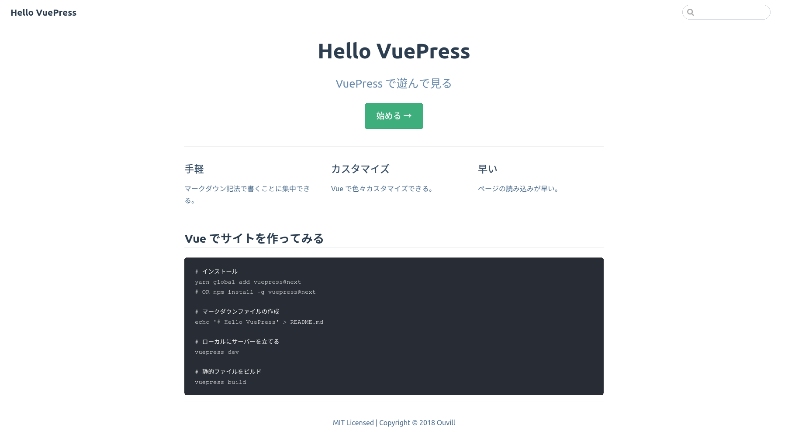

# VuePress の使い方

個人小説サイトを見ていたら [VuePress][] というものを利用して作成していらっしゃる人がいました。ページの遷移も早く、ドキュメントサイトとして利用するには便利そうだったので、調べてみました。

私は執筆時現在（2018/12/02）ブログは GatsbyJS 、自作小説の小説は Gitbook を利用しています。VuePress で一つサイトを立ち上げているのもいいでしょう。

## 静的サイトジェネレーターとは

サイトの記事部分とページの装飾を分離して管理できる。のちにビルドを行い、HTML、CSS、JavaScriptを生成するフレームワークやライブラリ。HTMLサーバーがあれば公開することが可能で、概して負荷が少ない。サーバーサイドではビルドさえしてしまえば、あとは配信するだけなのでセキュリティリスクも抑えられる。

静的サイトとして有名なのは以下のようなもの。

* GatsbyJs
* jekyll
* HUGO
* HEXO
* next.js
* VuePress

反対語は動的サイト。PHPやCGIで構成されており、ユーザーがアクセスするたびにコンテンツを生成する。代表的なのは Wordpress。

## VuePress とは

Vue.js を用いて開発されている静的サイトジェネレーター。Vueの作者の方が作成していらっしゃる。技術ドキュメント開発を主眼に作成されている。

## VuePress のインストール

yarm または npm でインストールします。

```bash
yarn global add vuepress@next 
# OR npm install -g vuepress@next
```

## VuePress でサイトを立ち上げる

公式の[ガイド](https://vuepress.vuejs.org/guide/)どおりにやってみましょう。

```bash
# install
yarn global add vuepress@next 
# OR npm install -g vuepress@next

# create a markdown file
echo '# Hello VuePress' > README.md

# start writing
vuepress dev

# build to static files
vuepress build
```

ページが生成されます。

```bash
veupress dev
```

のあとに`localhost:8080`にアクセスすると生成サイトを確認できます。



Markdown記法が使えるので色々ガシガシ書いてみてください。

## VuePress のフォルダ構成

VuePress のフォルダ構成は以下のうようになります。今後の説明はこのディレクトリ構成で説明します。

```
.
├── docs
│   ├── .vuepress (Optional)
│   │   ├── components (Optional)
│   │   ├── theme (Optional)
│   │   │   └── Layout.vue
│   │   ├── public (Optional)
│   │   ├── styles (Optional)
│   │   │   ├── index.styl
│   │   │   └── palette.styl
│   │   ├── templates (Optional, Danger Zone)
│   │   │   ├── dev.html
│   │   │   └── ssr.html
│   │   ├── config.js (Optional)
│   │   └── enhanceApp.js (Optional)
│   │ 
│   ├── README.md
│   ├── guide
│   │   └── README.md
│   └── config.md
│ 
└── package.json
```

`docs/README.md`がサイトのトップ画面になります。`docs/.vuepress`に各種設定ファイルが入ります。


## サイトの名前を設定する

サイトタイトルをつけましょう。`docs/.vuepress/config.js`を編集します。

```javascript
module.exports = {
    title: 'Hello VuePress',
    description: 'VuePress で遊んで見る'
}
```


## トップページをカスタマイズする

VuePress でサイトを生成しましたが、このままだと寂しいので変更しましょう。

せっかくなので [VuePress][] のトップページのようにしましょう。

`README.md`を編集します

```markdown
---
home: true
actionText: 始める →
actionLink: /guide/
features:
- title: 手軽
  details: マークダウン記法で書くことに集中できる。
- title: カスタマイズ
  details: Vue で色々カスタマイズできる。
- title: 早い
  details: ページの読み込みが早い。
footer: MIT Licensed | Copyright © 2018 Ouvill
---

## Vue でサイトを作ってみる

​```
# インストール
yarn global add vuepress@next
# OR npm install -g vuepress@next

# マークダウンファイルの作成
echo '# Hello VuePress' > README.md

# ローカルにサーバーを立てる
vuepress dev

# 静的ファイルをビルド
vuepress build
​```
```

以下のようなページができます。サクッといい感じのページができると嬉しいですね。




## サブページを作成する

`doc`フォルダ以下に格納されたMarkdownファイルは静的ファイルとして扱われれます。

`doc/guides/README.md` と作成されたファイルは `localhost:8080/guides/`からアクセスできます。

`doc/guides/sample.md`と作成されたファイルは`localhost:8080/guides/sample`からアクセスできます。

## サイドバーを用意する

サブページにアクセスしたらサイドバーがあったほうが便利ですよね。目次のようなものがあれば、利用者は見やすい。用意しましょう。`docs/.vuepress/config.js`を編集します。

```javascript
module.exports = {
    title: 'Hello VuePress',
    description: 'VuePress で遊んで見る',
        themeConfig: {
            	locales: {
                    '/': { 
                        sidebar: {
                            '/guide/': [
                                '/',
                                '',
                                'sample'
                            ],
                    '/': ['']
                }
            }
        }
    }
}

```

以上のようにすることで サイドバーが表示されます。

## やってみて

VuePress はドキュメントサイトとして利用するのであればかなり見やすいサイトが構築できると思います。ですが、やはりまだまだ発展途上である感じです。

ブログを書く場合は他の静的サイトジェネレーターかWordpressを利用したほうがいいかもしれません。

## 参考

* [VuePress](https://vuepress.vuejs.org/)
* [VuePress をお試ししてみた](https://blog.dojineko.ninja/2018/04/15/try-vuepress/)
* [VuePressの使い方！記事一覧と前後投稿リンク付きブログの作成方法](https://techblog.raccoon.ne.jp/archives/1537944919.html)


<a style="background-color:black;color:white;text-decoration:none;padding:4px 6px;font-family:-apple-system, BlinkMacSystemFont, &quot;San Francisco&quot;, &quot;Helvetica Neue&quot;, Helvetica, Ubuntu, Roboto, Noto, &quot;Segoe UI&quot;, Arial, sans-serif;font-size:12px;font-weight:bold;line-height:1.2;display:inline-block;border-radius:3px" href="https://unsplash.com/@sapegin?utm_medium=referral&amp;utm_campaign=photographer-credit&amp;utm_content=creditBadge" target="_blank" rel="noopener noreferrer" title="Download free do whatever you want high-resolution photos from Artem Sapegin"><span style="display:inline-block;padding:2px 3px"><svg xmlns="http://www.w3.org/2000/svg" style="height:12px;width:auto;position:relative;vertical-align:middle;top:-1px;fill:white" viewBox="0 0 32 32"><title>unsplash-logo</title><path d="M20.8 18.1c0 2.7-2.2 4.8-4.8 4.8s-4.8-2.1-4.8-4.8c0-2.7 2.2-4.8 4.8-4.8 2.7.1 4.8 2.2 4.8 4.8zm11.2-7.4v14.9c0 2.3-1.9 4.3-4.3 4.3h-23.4c-2.4 0-4.3-1.9-4.3-4.3v-15c0-2.3 1.9-4.3 4.3-4.3h3.7l.8-2.3c.4-1.1 1.7-2 2.9-2h8.6c1.2 0 2.5.9 2.9 2l.8 2.4h3.7c2.4 0 4.3 1.9 4.3 4.3zm-8.6 7.5c0-4.1-3.3-7.5-7.5-7.5-4.1 0-7.5 3.4-7.5 7.5s3.3 7.5 7.5 7.5c4.2-.1 7.5-3.4 7.5-7.5z"></path></svg></span><span style="display:inline-block;padding:2px 3px">Artem Sapegin</span></a>


[VuePress]:https://vuepress.vuejs.org