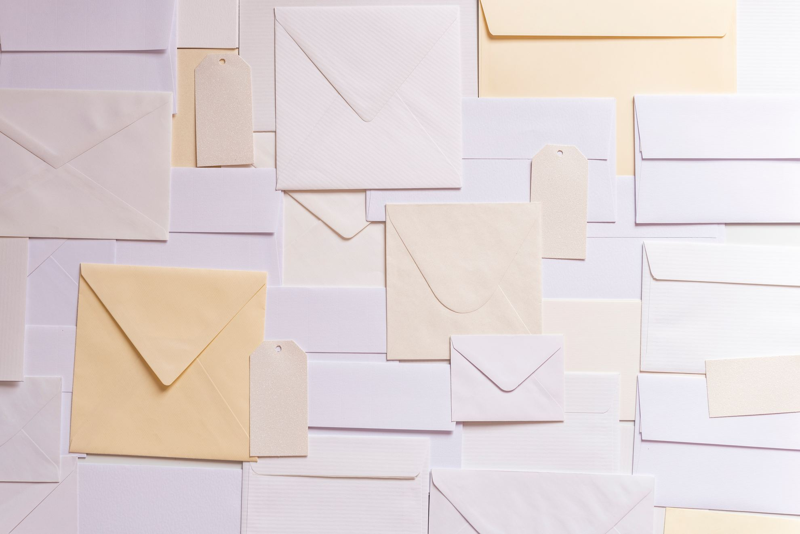

最近 メールアドレスが @yahoo.co.jp の人とやり取りする機会がありました。

メールをやり取りしていて気がついたのですが、yahoo.co.jp ドメインは TLS 暗号に対応していないんですね。

ちょっとそのへんどうなっているのって思うので記事作成

## TLS 暗号とは ( Transport Layer Security )

TLS暗号というのは、インターネット上での通信を暗号化し、第三者による通信内容の盗み見や改ざんを防ぐ技術です。メールの場合は、メールをやり取りするサーバー間で暗号化を行います。暗号化されているために盗聴や改ざんされる恐れがありません。

逆に TLS暗号 が施されていなければ、メールは平文で送信されて通信経路上の誰でも読むことができます。

なので TLS暗号 が施されていない場合は、機密情報や個人情報をメールで送ってはいけません。

## TLS 暗号に対応していないドメイン

TLS暗号に対応していないメールサービスは以下のようなものです。利用することをオススメしません。

| アドレス          | 提供サービス            |
| ----------------- | ----------------------- |
| ****@ezweb.ne.jp  | au キャリアメール       |
| ****@docomo.ne.jp | docomo キャリアメール   |
| ****@softbank.jp  | softbank キャリアメール |
| ****@yahoo.co.jp  | Yahoo Mail              |

国内の通信キャリアが提供しているメールはすべてアウトです。暗号化されていないので、セキュリティにやや不安があります。

yahoo.co.jp もTLS暗号が導入されていないので利用はオススメしません。

ただ最近キャリアメールを利用する人っているのでしょうか。かなり減ってきている印象があります。

## 対策

盗聴や改ざんに対策するためには、しっかりと TLS暗号を施してくれるメールサービスを選択しましょう。TLS暗号はメールサービス提供側が自動でやってくれるので、利用者は意識する必要がありません。

GMail や Outlook を利用していらっしゃる方は TLS 暗号がしっかりと施されているために安全にメールのやり取りをすることができます。

## オススメメールサービス（お手軽サービス）

Google や Microsoft が提供しているメールサービスです。使いやすい UI に大容量のメールボックス、カレンダーやオンラインストレージの連携と機能が豊富です。

* [Gmail](https://mail.google.com)
* [Outlook.com](https://outlook.live.com/owa/)

## オススメウェブメールサービス（さらにセキュリティ強固版）

とことんセキュリティに気をつけるならば以下のメールサービスがおすすめです。メールサービス提供者でもメールを見ることができないほどプライバシーに配慮しています。ただどちらも英語のサービスなので少しとっつきにくい所があるかもしれません。

* [Protonmail](https://protonmail.com)
* [Tutanota](https://tutanota.com)

## まとめ

ざっくりとしてメールのTLS暗号についてでした。

スマホが普及し、メールよりもLINEのようなメッセージアプリでメッセージをやり取りする人が増えていると思います。メールよりもそちらのほうが暗号化がしっかりされていたりするので、安全だったりもします。ただその場合も LINE よりも [Signal](https://signal.org) , [Wire](https://wire.com/en/) などのメッセージサービスの利用をオススメします。プログラムのソースコードを公開していて実際に安全であることが第三者から検証されているからです。

ただメールの安全性についても知っておいたほうがいいと思うので書きました。

<a style="background-color:black;color:white;text-decoration:none;padding:4px 6px;font-family:-apple-system, BlinkMacSystemFont, &quot;San Francisco&quot;, &quot;Helvetica Neue&quot;, Helvetica, Ubuntu, Roboto, Noto, &quot;Segoe UI&quot;, Arial, sans-serif;font-size:12px;font-weight:bold;line-height:1.2;display:inline-block;border-radius:3px" href="https://unsplash.com/@joannakosinska?utm_medium=referral&amp;utm_campaign=photographer-credit&amp;utm_content=creditBadge" target="_blank" rel="noopener noreferrer" title="Download free do whatever you want high-resolution photos from Joanna Kosinska"><svg xmlns="http://www.w3.org/2000/svg" style="height:12px;width:auto;position:relative;vertical-align:middle;top:-1px;fill:white" viewBox="0 0 32 32"><title>unsplash-logo</title><path d="M20.8 18.1c0 2.7-2.2 4.8-4.8 4.8s-4.8-2.1-4.8-4.8c0-2.7 2.2-4.8 4.8-4.8 2.7.1 4.8 2.2 4.8 4.8zm11.2-7.4v14.9c0 2.3-1.9 4.3-4.3 4.3h-23.4c-2.4 0-4.3-1.9-4.3-4.3v-15c0-2.3 1.9-4.3 4.3-4.3h3.7l.8-2.3c.4-1.1 1.7-2 2.9-2h8.6c1.2 0 2.5.9 2.9 2l.8 2.4h3.7c2.4 0 4.3 1.9 4.3 4.3zm-8.6 7.5c0-4.1-3.3-7.5-7.5-7.5-4.1 0-7.5 3.4-7.5 7.5s3.3 7.5 7.5 7.5c4.2-.1 7.5-3.4 7.5-7.5z"></path></svg>Joanna Kosinska</a>