ゲーマーに人気のボイスチャットツール、Discord は利用していますか。

ゲーム運営の公式ブログや攻略情報ブログの更新情報 ( RSS ) を Discord に流すことができれば便利だと思いませんか？

Discord は IFTTT と連携することで RSS を購読することができます。

今回はその方法についての記事です。

## IFTTT とは

複数のサービスを結びつけて、あることが起こったら、それに対応してなにか自動で実行させる仕組みを簡単に作成できるサービス。

"IF This Then That"、「もし〜ならば、そのときは〜する」を構築するサービス

### IFTTT の使用例

* メールにスターをつけると、Evernote に保存される。
* Twitter で**いいね**をおすと、Evernote に保存する。
* Twitter で呟くと、Facebook のユーザーページにも投稿する
* 雨が振りそうなら、メールで通知がくる

## Discord に RSS 通知を流す

それでは設定していきましょう。

順番としては、次の二つです。

- Discord と IFTTT 連携用に WebHook を用意する
- IFTTT で RSS を連携する

### Discord と IFTTT 連携用に WebHook を用意する

まずは公式サイトで情報の確認です。以下の URL が Webhook の解説になります。

<https://discordapp.com/developers/docs/resources/webhook>

Disord の Webhook URL を利用することで、外部プログラムから Discord のチャンネルにコメントを投稿できるようになる。

そのことを踏まえて設定していきましょう。

#### Discord のWebhook設定

「サーバー設定」-「Webhooks」からWebhookの設定をします。

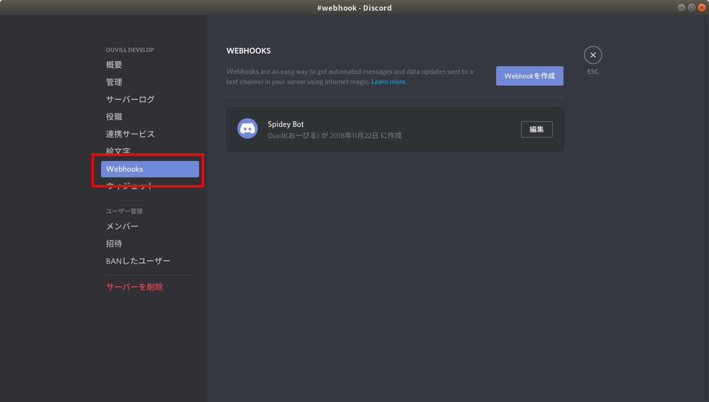

Webhookを作成をクリックして、以下のとおりオプション設定をしてください。

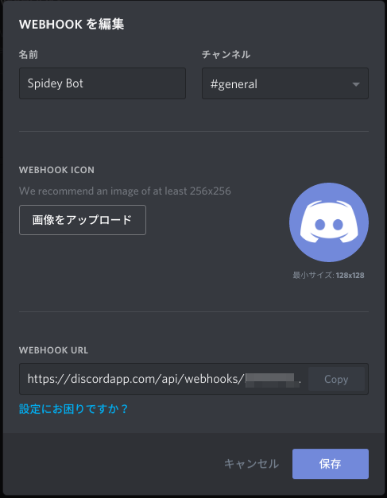

`チャンネル`：メッセージを投稿するチャンネルの選択
`名前`：メッセージを投稿する際のBOT名
`WEBHOOK ICON`：メッセージを投稿する際のユーザのアバターの編集

`WEBHOOK URL` をコピーしてメモしてください。

以上で Discord 側の設定は終了です。

### IFTTT で RSS を連携する

IFTTT で設定していきます。

#### IFTTT でアカウント登録をして、`New Applet` をクリック

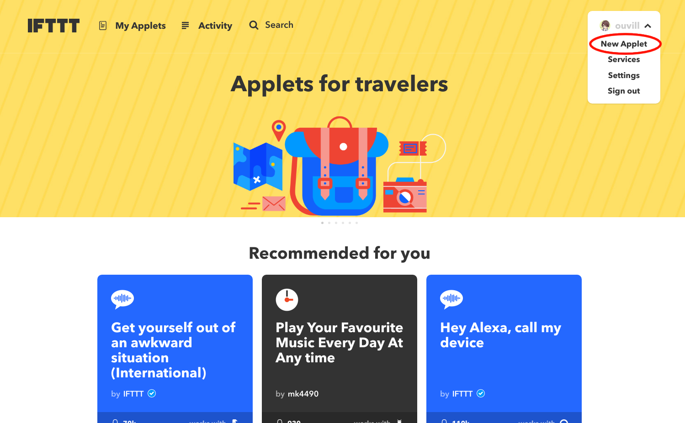

#### `this` をクリック

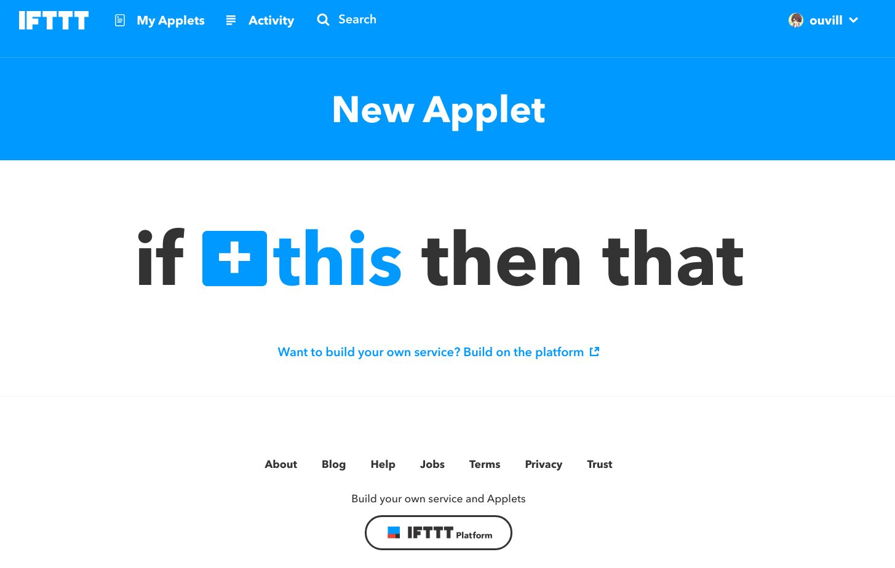

#### RSS をクリック

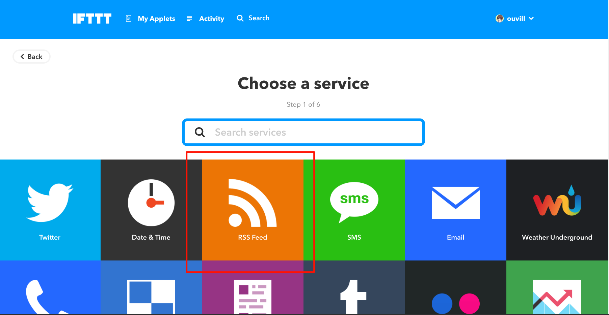

#### `New feed item` をクリック

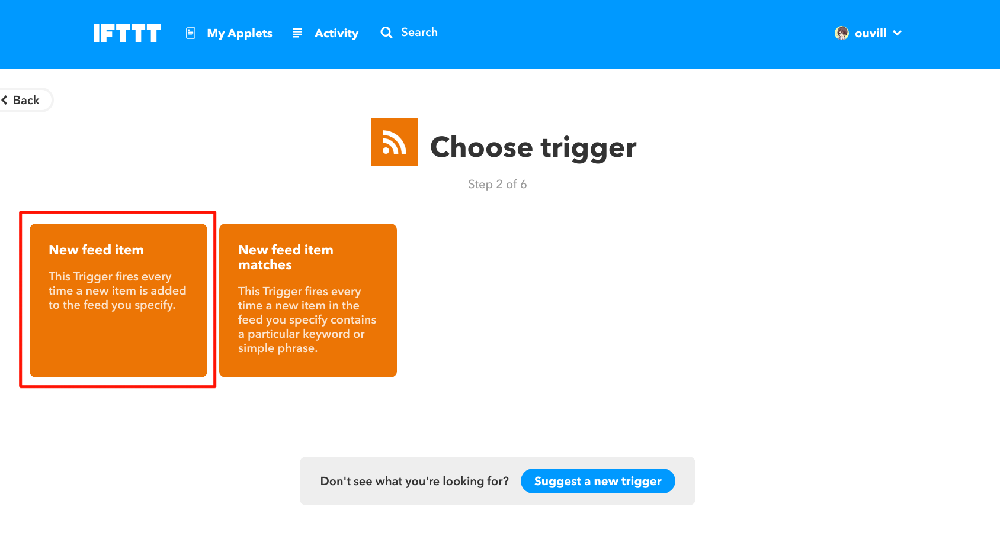

#### `Feed URL` に購読したい RSS の URL を記述する。記述したら `Create trigger` をクリック

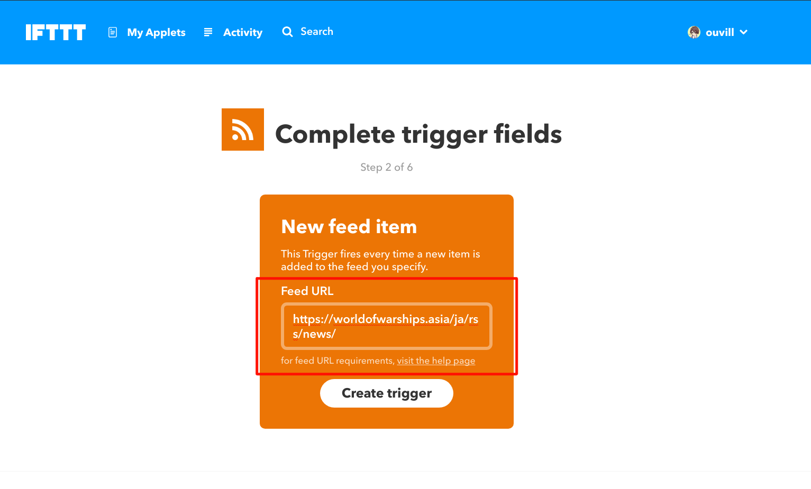

#### `that`をクリック

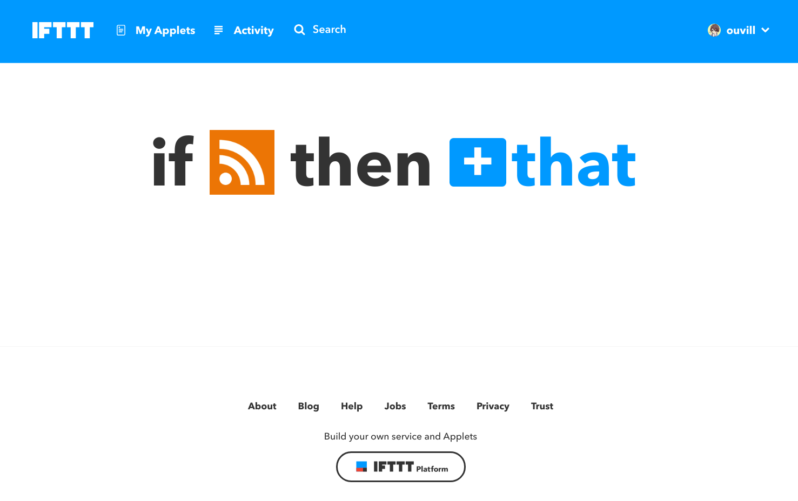

#### `webhooks`を選択。検索窓で `webhooks` と検索すると早い。

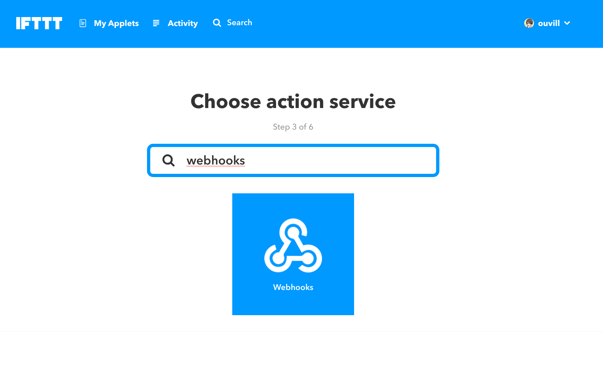

#### `Make a web request`をクリック

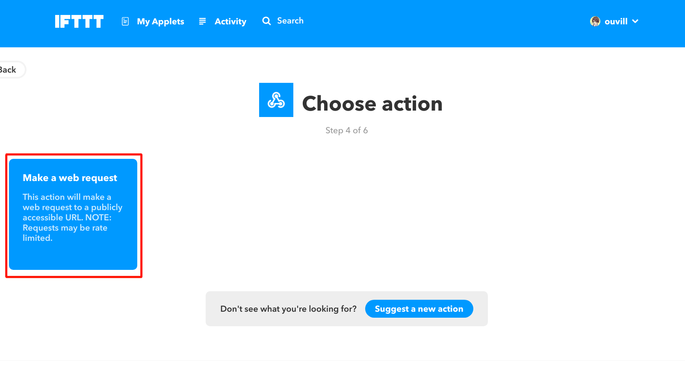

#### 各要素を入力
- `URL` に Discord で発行した Webhooks URL を記述
- `Method` で `POST` を選択
- `Content Type` で `application/json` を選択
- `Body` を以下のように記述

```json
{ "content" : " **{{EntryTitle}}** {{EntryPublished}} {{EntryUrl}} " }
```

※タイトルは太字で投稿日時、投稿URLをDiscordに投稿するように設定してある。Discord の Webhook については次のURL が詳しい（英語）https://discordapp.com/developers/docs/resources/webhook

設定できれば `Create action` をクリック

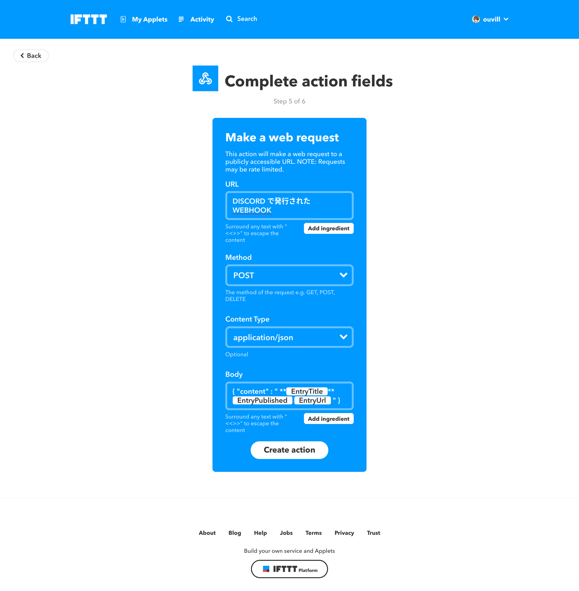

#### タイトルを設定して、`Finish`をクリック。

`Receive notifications ~~`については、実行時に通知を受け取るかどうかの設定なのでお好みで。~~OFFにしておいたほうが鬱陶しくない。~~

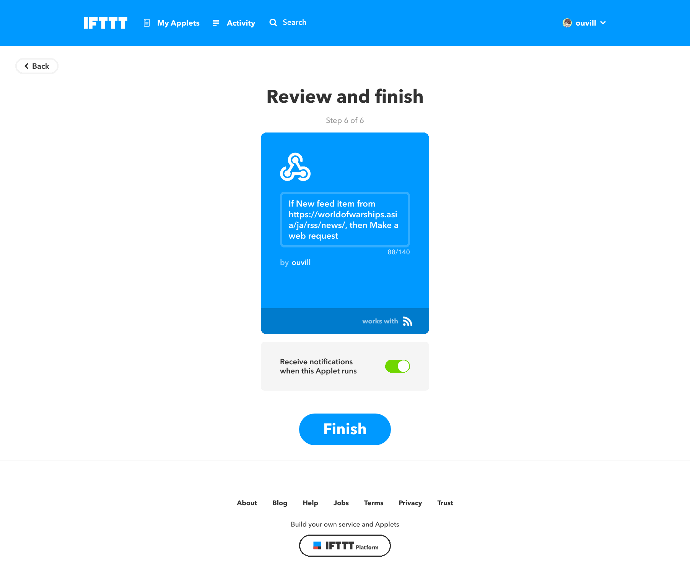

## まとめ

IFTTT を利用することで Discord に更新情報を通知できるようになります。

コミュニティメンバーに情報が行き渡り、プレイの向上に役立つでしょう。


Photo by [Glenn Carstens-Peters](https://unsplash.com/photos/0woyPEJQ7jc?utm_source=unsplash&utm_medium=referral&utm_content=creditCopyText) on [Unsplash](https://unsplash.com/search/photos/game?utm_source=unsplash&utm_medium=referral&utm_content=creditCopyText)
