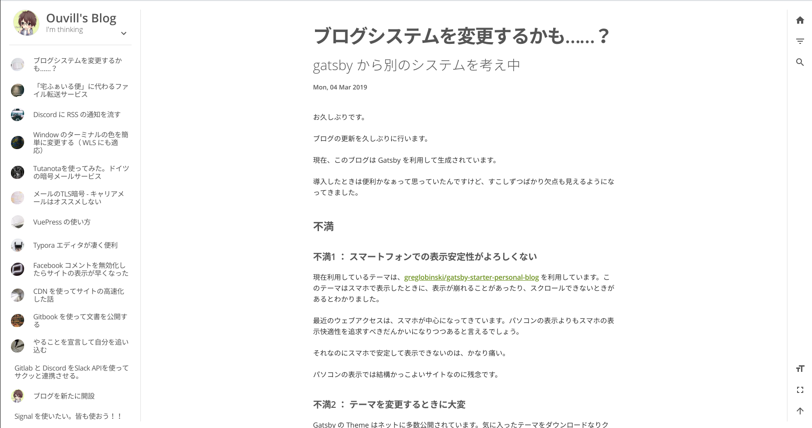

ブログシステムを Gatsby から Veupress に変更しました。Vuepress もかなり開発が進み、ブログ運用もやりやすくなっています。

<!-- more -->

## Gatsby から Vuepress へ変更した理由

- React よりも Vue が伸びそう
- 使用しているテーマにバグがあるが、テーマ作成者は修正する気がない。

## デザインの変更

Vuepress を導入するにあたり、ブログのデザインを変更しました。
悲しいことにブログをデザインする技術やセンスはないので、Github で公開されている Vuepress のテーマを適応しました。

github: [meteorlxy/vuepress-theme-meteorlxy](https://github.com/meteorlxy/vuepress-theme-meteorlxy)

demo: [https://vuepress-theme-meteorlxy.meteorlxy.cn](https://vuepress-theme-meteorlxy.meteorlxy.cn)

こちらのテーマは多言語対応できるように設計されていましたが、日本語(ja-JP) に対応していなかったので、私のほうで日本語に翻訳しました。[プルリクエスト](https://github.com/meteorlxy/vuepress-theme-meteorlxy/commit/d39a5ca)を送り、無事本家にもマージされたので、他の人でも日本語利用可能です。

旧ブログデザイン

新ブログデザイン

## インストールしたプラグイン

- vuepress-plugin-sitemap: /sitemap.xml にサイトマップを生成
- plugin-google-analytics: google analytics の導入
- vuepress-plugin-feed: RSS や XML の生成
- vuepress-plugin-seo: og タグの生成

## 既知の問題

- ~~ブログ記事の並びが微妙におかしい。日付順になっているのかなと思っていたら、微妙に違う。修正が必要~~ ~~いつの間にか治っていた。ライブラリの方で修正されたっぽい？(2019/03/30追記)~~ [こちらのコミット](https://github.com/meteorlxy/vuepress-theme-meteorlxy/commit/7da22552d4254f77529cc4af4f22a6a01267eb3a) で修正されていました。
