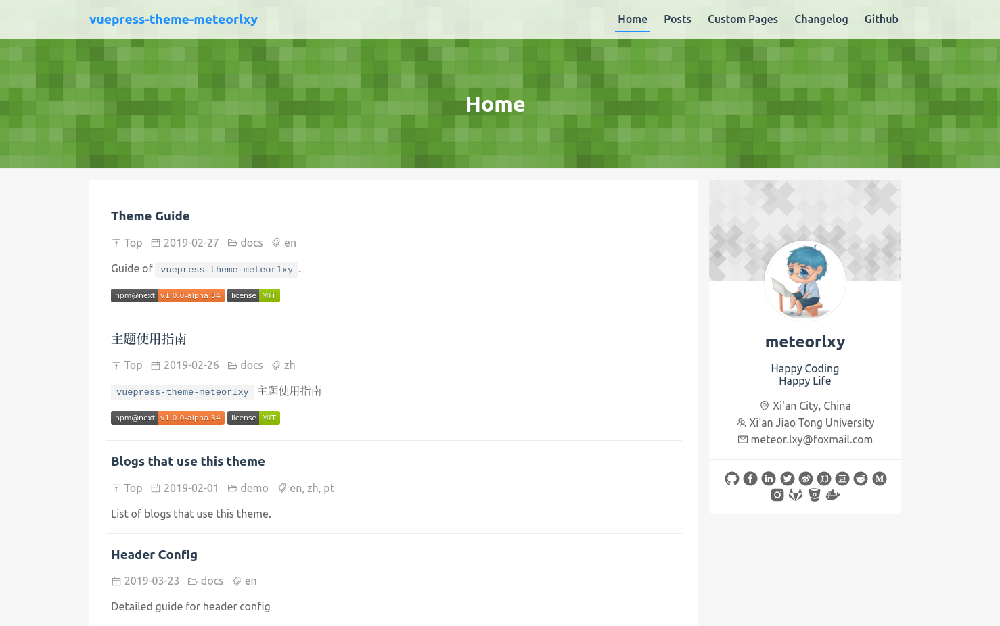

Vuepress でブログ運営できるんではないかと思ったので、現在このブログは Vuepress で作成されています。

<!-- more -->

::: tip 注釈
基本的な Vuepress の使い方は「[VuePress の使い方](../2018-12-02--vuepress/vuepress.md) 」で書きました。こちらも参考にしてください。
:::

## Vuepress のプロジェクトを作成する

## vuepress をインストールします

```bash
# node プロジェクト作成
mkdir vuepress_blog
cd vuepress_blog
npm init # Enter 連打 (設定しても可)

# vuepress のインストール
npm install -s vuepress@next
```

## vuepress のテーマを適応する

デフォルトの Vuepress のテーマも素敵なのですが、ちょっと味気ないのでテーマを適応します。個人的に[vuepress-theme-meteorlxy](https://vuepress-theme-meteorlxy.meteorlxy.cn/) というテーマファイルが素敵だなと思っているのでこちらを適応します。

```bash
npm install -s vuepress-theme-meteorlxy@next
```

ソースファイルはこちらgithub: [meteorlxy/vuepress-theme-meteorlxy](https://github.com/meteorlxy/vuepress-theme-meteorlxy)

vuepress-theme-meteorlxy を適応したサイト例



## vuepress に必要なファイルを用意する

vuepress でブログを書くのに必要なフォルダやファイルを用意していきます。
以下のようなフォルダ構成にします。

```bash
vuepress_blog
├── node_modules
├── src # ブログのソースファイル
│   ├── .vuepress # Vuepress の設定フォルダ
│   │   └── config.js # Vuepress config ファイル
│   └── _posts # 記事用ディレクトリ
│       ├── xxx.md
│       ...
├── package-lock.json
└── package.json
```

- `src/.vuepress` フォルダには vuepress の設定ファイルが入ります。
- `src/.vuepress/config.js` にサイトタイトルや使用するプラグイン、テーマ設定を記述します
- `_posts` にブログ記事を投稿します

以下のコマンドでフォルダを作れます。

```bash
mkdir -p src/{.vuepress,_posts}
touch src/config.js
```

## package.json の編集

vuepress のビルド設定を行います。`package.json`の`script`フィールドに以下を追加してください。

```json
{
  "scripts": {
    "dev": "vuepress dev src",
    "build": "vuepress build src --dest dist"
  }
}
```

package.json 全体では以下のようになります。

<details>

<summary>クリックで展開</summary>

```json
{
  "name": "vuepress_blog_sample",
  "version": "1.0.0",
  "description": "",
  "main": "index.js",
  "scripts": {
    "dev": "vuepress dev src",
    "build": "vuepress build src --dest dist"
  },
  "author": "",
  "license": "ISC",
  "dependencies": {
    "vuepress": "^1.0.0-alpha.44",
    "vuepress-theme-meteorlxy": "^1.0.0-alpha.32"
  }
}
```

</details>

## Vuepress の設定

`src/.vuepress/config.json` を編集します。
サンプルを掲載します。

変更するべき場所は、`title`, `descritption`, `themeConfig` です。`themeConfig`は編集場所が多いです。その他の場所も好みに応じて編集してください。

<details>

<summary>サンプルはクリックで展開</summary>

```js
// .vuepress/config.js

module.exports = {
  // Title of your website
  title: 'My Blog',
  // Description of your website
  description: 'This is my blog',
  // Language of your website
  locales: {
    '/': {
      lang: 'ja-JP',
    },
  },
  // Theme to use
  theme: 'meteorlxy',
  // Theme config
  themeConfig: {
    // Language of this theme. See the [Theme Language] section below.
    lang: require('vuepress-theme-meteorlxy/lib/langs/ja-JP'),
    // Personal infomation (delete the fields if you don't have / don't want to display)
    personalInfo: {
      // Nickname
      nickname: 'meteorlxy',
      // Introduction of yourself
      description: 'Happy Coding<br/>Happy Life',
      // Email
      email: 'meteor.lxy@foxmail.com',
      // Your location
      location: 'Xi\'an City, China',
      // Your organization
      organization: 'Xi\'an Jiao Tong University',
      // Your avatar image
      // Set to external link
      avatar: 'https: //www.meteorlxy.cn/assets/img/avatar.jpg',
      // Or put into `.vuepress/public` directory. E.g. `.vuepress/public/img/avatar.jpg`
      // avatar: '/img/avatar.jpg',
      // Accounts of SNS
      sns: {
        // Github account and link
        github: {
          account: 'meteorlxy',
          link: 'https: //github.com/meteorlxy',
        },
        // Facebook account and link
        facebook: {
          account: 'meteorlxy.cn',
          link: 'https: //www.facebook.com/meteorlxy.cn',
        },
        // LinkedIn account and link
        linkedin: {
          account: 'meteorlxy',
          link: 'http: //www.linkedin.com/in/meteorlxy',
        },
        // Twitter account and link
        twitter: {
          account: 'meteorlxy_cn',
          link: 'https: //twitter.com/meteorlxy_cn',
        },
        // Sina Weibo account and link
        weibo: {
          account: '@焦炭君_Meteor',
          link: 'https: //weibo.com/u/2039655434',
        },
        // Zhihu account and link
        zhihu: {
          account: 'meteorlxy.cn',
          link: 'https: //www.zhihu.com/people/meteorlxy.cn',
        },
        // Douban account and link
        douban: {
          account: '159342708',
          link: 'https: //www.douban.com/people/159342708',
        },
        // Reddit account and link
        reddit: {
          account: 'meteorlxy',
          link: 'https: //www.reddit.com/user/meteorlxy',
        },
        // Medium account and link
        medium: {
          account: 'meteorlxy.cn',
          link: 'https: //medium.com/@meteorlxy.cn',
        },
        // Instagram account and link
        instagram: {
          account: 'meteorlxy.cn',
          link: 'https: //www.instagram.com/meteorlxy.cn',
        },
        // GitLab account and link
        gitlab: {
          account: 'meteorlxy',
          link: 'https: //gitlab.com/meteorlxy',
        },
        // Bitbucket account and link
        bitbucket: {
          account: 'meteorlxy',
          link: 'https: //bitbucket.org/meteorlxy',
        },
        // Docker Hub account and link
        docker: {
          account: 'meteorlxy',
          link: 'https: //hub.docker.com/u/meteorlxy',
        },
      },
    },
    // Header Config
    header: {
      // The background of the header. You can choose to use an image, or to use random pattern (geopattern)
      background: {
        // URL of the background image. If you set the URL, the random pattern will not be generated, and the `useGeo` will be ignored.
        url: '/assets/img/bg.jpg',
        // Use random pattern. If you set it to `false`, and you don't set the image URL, the background will be blank.
        useGeo: true,
      },
      // show title in the header or not
      showTitle: true,
    },
    // Show the last updated time of your posts
    lastUpdated: true,
    // The content of your navbar links
    nav: [
      {
        text: 'Home', link: '/', exact: true
      },
      {
        text: 'Posts', link: '/posts/', exact: false
      },
    ],
    // Comments config. See the [Posts Comments] section below.
    comments: false,
    // comments: {
    //   owner: 'meteorlxy',
    //   repo: 'vuepress-theme-meteorlxy',
    //   clientId: 'MY_CLIENT_ID',
    //   clientSecret: 'MY_CLIENT_SECRET',
    // },
  },
}
```

</details>

お疲れ様です。以上で Vuepress の設定が完了しました。

## 記事を書く

設定が完了したので、記事を書きましょう。今回適応した[テーマ (vuepress-theme-meteorlxy)](https://github.com/meteorlxy/vuepress-theme-meteorlxy) では `_posts` フォルダ中の Markdown ファイルがブログポストとして扱われます。

ファイルを作成して記事を作成していきましょう

```bash
touch src/_posts/2019-03-29-hello-world.md
```

サンプル記事を掲載します。`---` で囲まれた部位は front matter と呼ばれます。ブログタイトルやカテゴリー、タグを設定できます。

```markdown
---
category: hello
tags:
  - world
date: 2019-01-21
title: Hello, world!
vssue-title: Hello, world!
---

これは最初の投稿です。

`more`より上にかかれたことは、記事リストの中に表示されます

<!-- more -->

`more` より下にかかれたことは、記事にアクセスされたときしか表示されません。記事リストに内容は表示されません。
```

## 動作確認する

```bash
# ライブプレビュー：localhost:8080 でサイト表示を確認できる
npm run dev
# ビルド: `dist` フォルダにサイトが生成される
npm run build
```

## Netlify に配置する場合

Netlify で公開するときのDeploy 設定は以下の通りです

- Build command: `npm run build`
- Publish directory: `dist/`

## SEO 対策を施す

SEO 対策を施しましょう。以下のプラグインを私は導入しました。

- [vuepress-plugin-sitemap](https://github.com/ekoeryanto/vuepress-plugin-sitemap): /sitemap.xml を生成します。google search console に登録することで効率的にクロールしてくれます。
- [@vuepress/plugin-google-analytics](https://v1.vuepress.vuejs.org/plugin/official/plugin-google-analytics.html): Google アナリティクスを追加します。プライバシーポリシーに解析する旨を記述してください。
- [vuepress-plugin-seo](https://github.com/lorisleiva/vuepress-plugin-seo): og タグや twitter カードの生成をしてくれます。

## その他のプラグイン

私はSEO対策のほかに以下のプラグインも導入しました。

- [vuepress-plugin-feed](https://github.com/webmasterish/vuepress-plugin-feed): RSS を生成します.

## まとめ

以上が Vuepress でブログ運用する方法です。

より詳しい情報を得たい場合、[Vuepress 公式サイト](https://v1.vuepress.vuejs.org/) や [テーマの作者サイト](https://vuepress-theme-meteorlxy.meteorlxy.cn/
) を閲覧してください。

## 参考

https://vuepress-theme-meteorlxy.meteorlxy.cn/
