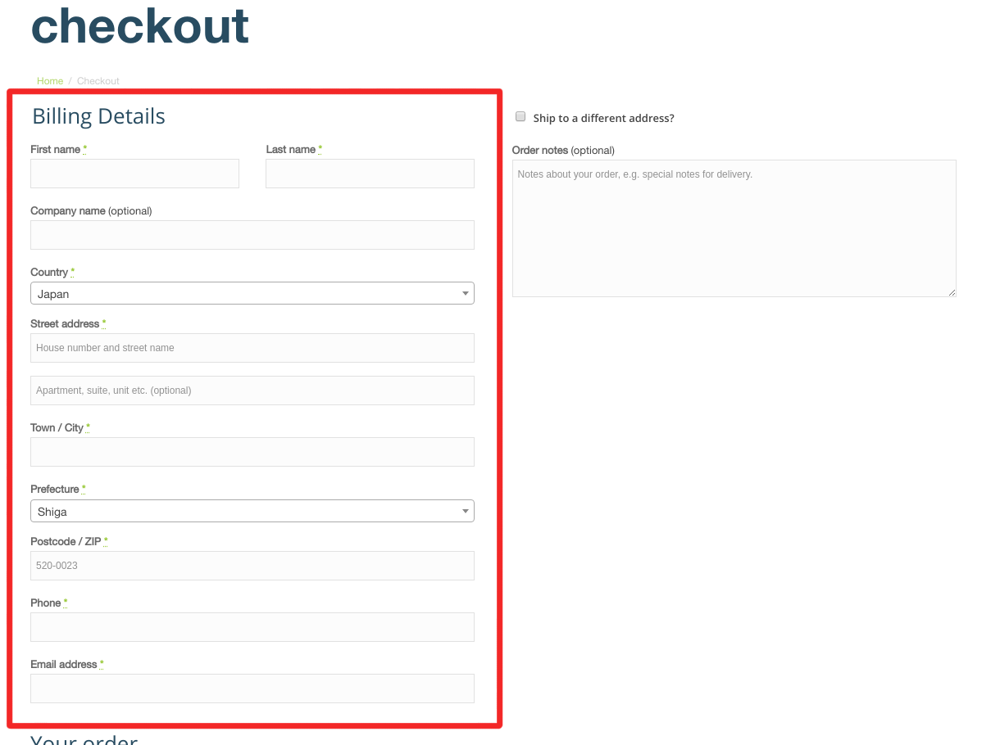

Yubikey は Yubico 社が提供しているセキュリティデバイスです。FIDO U2F や FIDO2, OATH, OTP といった二段階認証用デバイスとして利用できたり、PIV Card や OpenPGP Card として利用できる機能を持っています。今回は海外から個人輸入する方法をご紹介します。

<!-- more -->

## Yubieky の購入方法

現在、最新版の Yubikey 5 の購入方法は以下のようなものがあります。

- amazon で日本国内の正規代理店（ソフト技研）から購入
- Yubico の公式ホームページから個人輸入

軽く説明します。

### amazon で日本国内の正規代理店（ソフト技研）から購入

日本国内の正規代理店であるソフト技研が、Yubikey 5 シリーズを [amazon.co.jp](https://amzn.to/2TUoBq2) で販売しています。

在庫があれば、すぐに発送してくれて、注文も簡単です。

ただ個人輸入する場合と比べると、代理店を通す関係上やや値段が高くなる傾向があります。

<iframe style="width:120px;height:240px;" marginwidth="0" marginheight="0" scrolling="no" frameborder="0" src="//rcm-fe.amazon-adsystem.com/e/cm?lt1=_blank&bc1=000000&IS2=1&bg1=FFFFFF&fc1=000000&lc1=0000FF&t=ouvill-22&language=ja_JP&o=9&p=8&l=as4&m=amazon&f=ifr&ref=as_ss_li_til&asins=B07HBD71HL&linkId=3c2ce9f59f94dc4aa308020054542017"></iframe>

### Yubico の公式ホームページから個人輸入

Yubikey の販売元の Yubico は全世界[^1]に発送しています。[公式サイト](<https://www.yubico.com/>)から注文することで日本に送ってもらうことも可能です。公式サイトでは Yubikey 5 NFC が 45 $ , 発送料が 5 $ となっています[^2]。為替にもよりますが、正規代理店よりも安く購入できます。

さらに時々 10%OFF や 20%OFF のクーポンが配られていたりするので、お得に購入することができます。

なお発送はアメリカ、もしくは、ノルウェーからになるので、注文してから手元に届くまでにかなりの時間がかかります。

[^1]: 一部発送を制限している国があります。
[^2]: 記事作成時(2019/04/04) の価格

::: tip 補足

管理人が Yubikey 5 を購入したときは、日本国内の正規代理店であるソフト技研は Yubikey 5 を取り扱っていませんでした。必然的に個人輸入しか手に入れる方法がありませんでした。

:::

## Yubikey 5 のおすすめモデル

Yubikey 5 NFC の購入をオススメします。一番汎用性が高いためです。

現在 Yubico が販売する Yubikey シリーズの最新モデルは Yubikey 5 です。 Yubikey 5 は USB-A と USB-C の接続形式、着脱を前提とするかで 4つのモデルに分かれています。Yubikey 5 NFC, Yubikey 5 Nano, Yubikey 5C, Yubikey 5C Nano の4つです。

機能的には全て同じです。ご自身の所有しているパソコンにあったものを購入しましょう。

私は Yubikey 5 NFC を購入しました。さらにバックアップ用として、Security Key NFCも購入しました。手元にあるパソコンが USB-A しか搭載してないものがあったり、スマホでも利用したいがためです。USB-C しか搭載していないパソコンには変換ケーブルで対応しています。

::: danger

Yubikey 5C を購入して、変換ケーブルを用いて、USB-A に接続する方法は推奨しません。USB-C オスを USB-A オスに変換する規格は、USB として定義されていないためです。過剰電力が流れる恐れがあるため規格として定義されませんでした。

:::

## Yubico から個人輸入する

- Yubico の[ストアページ](https://www.yubico.com/store/)に行きます。

- 購入したいモデルの `Buy Now` をクリックし、商品詳細ページを開きます。
- `Add to cart` をクリックし、カートに追加します。
- `View Cart` で決済画面に行きます。
- `Calculate Shipping` をクリックし、`Japan` を選択、都道府県を選択、`Postcode/Zip` に郵便番号を入力します( 000-0000 形式) 
- 配送方法を選択します。急がない場合 5$ の `Posten 1st Class` で良いでしょう。
- `Proceed to checkout` をクリックします
- 支払い情報を入力します 
    -`First name`(名前) 、`Last name`(名字) を入力
    - `Country` に `Japan`
    - `Street address` に住所
    - `Town/City` に市区町村名
    - `Prefecture` に都道府県
    - `Postcode/ZIP` に郵便番号
    - `Phone` に電話番号
    - `Email address` にメールアドレス
- 支払い方法を選択します。 `Paypal` が良いと思います。
- `I agree to the terms and conditions of sale and license.` にチェックマークを入れます。
- `Place order` で注文完了です。

## まとめ

Yubikey の購入についてでした。

個人輸入することで
