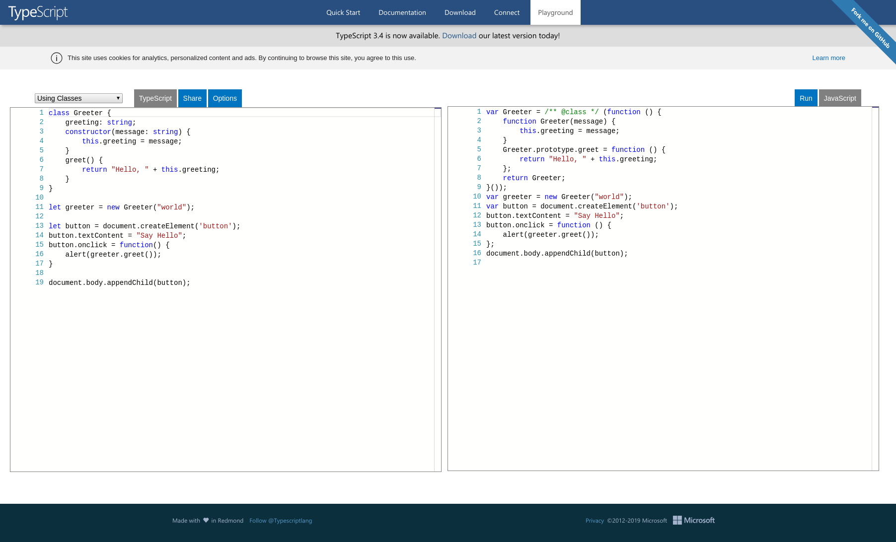

JavaScript の上位互換といわれる TypeScript 。[TypeScript - JavaScript that scales](https://www.typescriptlang.org/) を見て勉強しました。学んだ内容を解説しようと思います。

<!-- more -->

## TypeScript とは

Typescript とは JavaScript を拡張した言語です。コンパイルすることで生の JavaScript を生成することができます。マイクロソフトが主導で開発しています。

Typescript では 変数にデータ型をつけることができ、静的チェックやコードリファクタリングなどを行うことができ、生産性が高いです。

## TypeScript のデモ

TypeScript の[デモの実行環境](https://www.typescriptlang.org/play/)を公式が用意してくれています。画面左側が TypeScript 、 右側がコンパイルした結果生成される JavaScript になっています。

TypeScript のコード学習にとても有用です。



## Typescript をインストール、コンパイル

Typescript のコンパイラは Node.js パッケージとして配布されています。

### インストール

```bash
npm install -g typescript
```

### コンパイル

```
tsc helloworld.ts
```

## TypeScript のサンプルコードを書いてみる。

[TypeScript in 5 minites](https://www.typescriptlang.org/docs/handbook/typescript-in-5-minutes.html) のドキュメントを参考にサンプルコードを書きます。

`greeter.ts` という名前で保存しました。

```ts
function greeter(person) {
  return "Hello, " + person;
}

let user = "Jane User";

document.body.innerHTML = greeter(user);
```

TypeScript を書いたつもりですが、書いている内容は、JavaScript です。TypeScript 特有の書き方はありません。とりあえずコンパイルしてみます。

```bash
tsc greeter.ts
```

`greeter.js` が生成されました。生成されたソースを確認すると、TypeScript と JavaScript の内容は全く一緒。TypeScript 特有の書き方をしてないので当たり前ですね

### TypeScript の型

では TypeScript 特有の型を利用してみます。関数の引数を型つきで宣言してみます。`person` 引数に `string` 型を与えます。

```ts
function greeter(person: string) {
  return "Hello, " + person;
}

let user = "Jane User";

document.body.innerHTML = greeter(user);
```

こちらはコンパイルしてみると、正常にコンパイルできます。

次に、関数宣言時に`string`型の引数を指定しておきながら、別の型の引数を与えてみます。

```ts
function greeter(person: string) {
  return "Hello, " + person;
}

let user = [0, 1, 2];

document.body.innerHTML = greeter(user);
```

コンパイルしてみると、以下のようなエラーが発生します。

```bash
Argument of type 'number[]' is not assignable to parameter of type 'string'.
```

`number[]`型の引数は`string`型に割り当てられないと怒られてしまいます。

このように TypeScript では型があっていなければ、警告を発します。このためプログラムのバグに気づきやすくなります。

::: warning

ただし、TypeScript はエラーを発生していたとしても、`js` ファイルを生成します。この場合、TypeScript は、そのコードは予期したとおりには動作しないだろうと警告を発します。

:::

### TypeScript の Interface（インターフェース）

TypeScirpt では Interface を利用できます。サンプルコードでは、firstName と lastName のフィールドがあるとしています。

```ts
interface Person {
  firstName: string;
  lastName: string;
}

function greeter(person: Person) {
  return "Hello, " + person.firstName + " " + person.lastName;
}

let user = { firstName: "Jane", lastName: "User" };

document.body.innerHTML = greeter(user);
```

### TypeScript Classes ( クラス )

TypeScript ではクラスがあります。TypeScript はクラスベースのオブジェクト指向プログラムなど JavaScript の新機能をサポートしています。

コンストラクタといくつかのパブリックフィールドをもった`Student` クラスを作成してみます。

::: tip

コンストラクタの引数に `public` をつけることで、自動的にクラスフィールドを作成されます。

:::

```ts
class Student {
  fullName: string;
  constructor(
    public firstName: string,
    public middleInitial: string,
    public lastName: string
  ) {
    this.fullName = firstName + " " + middleInitial + " " + lastName;
  }
}

interface Person {
  firstName: string;
  lastName: string;
}

function greeter(person: Person) {
  return "Hello, " + person.firstName + " " + person.lastName;
}

let user = new Student("Jane", "M.", "User");

document.body.innerHTML = greeter(user);
```

### TypeScript を Web 上で動かす。

TypeScript を利用して Web アプリを作成してみます。

`greeter.html` 作成します。

```html
<!DOCTYPE html>
<html>
  <head>
    <title>TypeScript Greeter</title>
  </head>
  <body>
    <script src="greeter.js"></script>
  </body>
</html>
```

`greeter.html` を開いてみて、TypeScript Web アプリケーションの動作を確認してみましょう。

## まとめ

TypeScript についてざっくりとしたまとめでした。型宣言や Class 宣言などが簡単に行えるため JavaScript よりも安全なプログラムが作成可能となります。

## 参考

[TypeScript - JavaScript that scales](https://www.typescriptlang.org/)
