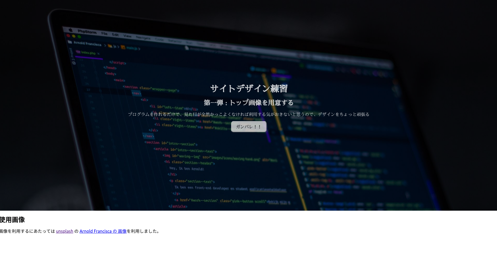

HTML のデザインを勉強するためにかなり簡単なサイトを作成しました。



[作成したサイト](https://5cb84869267f4f0008c1c4d6--sleepy-turing-c8d56f.netlify.com/)

[作成したサイト その次の日](https://sleepy-turing-c8d56f.netlify.com/)

[ソースコード](https://github.com/Ouvill/web_design_practice_1)

どういうふうに作成したのか解説していきます。

## 環境構築

node.js がインストールされていることを前提にしています。

React に慣れるために無駄に react-create-app で React の開発環境を用意します。ペライチのサイトを用意するならば、必要無いのですが、webpack-dev-server やその他諸々の設定も一気にやってくれるので、ありがたく使っていきます。

```bash
npx react-create-app web-design-practice-1 --typescript
```

今回は利用していませんが、今後 TypeScript も利用したいので`--typescript` オプションを有効にしています。

プロジェクトが作成されたら、プロジェクトの中に移動します。

```bash
cd web-design-practice-1
```

ライブプレビュー機能がついたサーバーを以下のコマンドで建てれます。

```bash
npm start
```

Sass/SCSS も利用したいので、以下のコマンドで導入します。

```bash
npm install -D node-sass
```

上記のコマンドを実行した後にビルドエラーが発生するようになった場合、以下のコマンドで治るかもしれません。

```bash
npm install
```

## App.tsx の中身を編集

サイトのデザインを作成するために、App.tsx を編集します。以下のように全面的に書き換えました。

```js
import React, { Component } from "react";
import "./App.scss";

class App extends Component {
  render() {
    return (
      <div className="Site">
        <header className="Site-header">
          <div className="top-wrapper">
            <div className="top-container">
              <h1>サイトデザイン練習</h1>
              <h2>第一弾 : トップ画像を用意する</h2>
              <p>
                プログラムを作れるだけで、見た目が全然かっこよくなければ利用する気がおきないと思うので、デザインをちょっと頑張る
              </p>
            </div>
          </div>
        </header>
      </div>
    );
  }
}

export default App;
```

### CSS Reset

`h1`, `h2`, `h3`, `ul`, `li`, などはブラウザごとに見え方が異なるときがあります。

ブラウザごとに見え方が違ったらデザインがずれてしまうので、CSS の設定をリセットしてブラウザ間の差異をなくします。

今回は [Normalize.css](https://necolas.github.io/normalize.css/) を利用します。

Normalize.css は HTML5 にも対応しており、 [Bootstrap](https://getbootstrap.com/), [HTML5 Boilerplate](https://html5boilerplate.com/) などで利用されています。

```
npm install -s normalize.css
```

Normalize.css を `index.tsx` にインポートして、サイトデザインに反映させます。

```js
// index.tsx の先頭
import React from "react";
import ReactDOM from "react-dom";
import "./index.css";
import "normalize.css"; // 追加
import App from "./App";
import * as serviceWorker from "./serviceWorker";
```

### TOP 画像の準備

サイトのトップには目を引くようなキレイな画像を用意します。それだけで一気にサイトの雰囲気が良くなるからです。

画像を探すのに [unsplash](https://unsplash.com/) を利用しました。多数の美しい写真が公開されており、無料で利用することができるサイトです。

今回使用した画像は Arnold Francisca さんの[画像](https://unsplash.com/photos/f77Bh3inUpE?utm_source=unsplash&utm_medium=referral&utm_content=creditCopyText)を利用しました。

unsplash からダンロードできる写真は 1 ~ 3 MB ほどあることもあり、かなり画像サイズが大きいです。

そのため、コマンドラインから利用できる画像編集ソフト`imagemagic` を使って、サイズを小さくします。もちろん、画像を縮小できるのならば、他のソフトでもいいです。

```bash
convert -geometory 1920 input.png cover.jpg
```

画像を縮小したら`public/img`フォルダの中に画像を格納しました。

```bash
mkdir public/img
mv public/img cover.jpg
```

### TOP 画像を読み込む

画像も用意できましたし、HTML も用意できました、CSS Reset もしました。後は CSS でサイトのデザインを弄るだけです。

`src/App.scss` を作成してデザインしていきます。

```scss
.top-wrapper {
  background-image: url("/img./cover.jpg");
  background-size: cover;
  width: 100%;
  min-height: 80vh;
  position: relative;
}
```

背景に画像が読み込みました。`background-size: cover` と指定することで画像の縮小をよしなにやってくれます。

### 文字の位置調整

次に文字の位置を調整します。中央寄せにします。

```scss
.top-container {
  text-align: center;
  position: absolute;
  top: 50%;
  left: 50%;
  transform: translateY(-50%) translateX(-50%);
}
```

親要素の左上の位置から、上から 50%, 左から 50% 移動させた後に、.top-container の高さ 50%、幅 50% 分、上と左に移動しています。こうすることで中央寄せを実現しています。

### フォントを指定する

文字色が見にくいので、フォント、色を指定します。明朝体を採用してしゅっとした印象にしていきます。

日本語のフォントを指定する場合、`MS 明朝` や `ヒラギノ明朝体` を指定してもいいのですが、それだとパソコンによってはフォントがインストールされていないことがあり、意図しないフォントが表示されてしまうこともあります。

ページを開いたときに Web フォントを読み込むように設定すると、クライアント側のフォントのあるなしを意識する必要がなくなります。

[Google フォント + 日本語](https://googlefonts.github.io/japanese/) は無料で Web フォントを利用できる Google が提供しているサービスです。今回はこちらを利用します。今回はさわらびフォントを採用しました。

`public/index.html` のヘッダー要素内に以下を記述します。

```html
<link
  href="https://fonts.googleapis.com/css?family=Sawarabi+Mincho"
  rel="stylesheet"
/>
```

`src/App.scss` にフォントフェイスを指定します。

```scss
.top-container {
  // 省略
  color: white;
  opacity: 0.9;
  font-family: "Sawarabi Mincho";
}
```

### 画像の明度を下げる

今の状態でも良いのですが、やや背景画像が主張し過ぎな気がします。もう少しおとなしくしていて欲しい。

そのために背景画像の明度を下げて、大人しくしてもらいます。

方法としては、画像の前面を半透明の黒で塗りつぶすことで実現します。

画像を読み込んでいるブロック要素の`::before`を利用します。

```scss
.top-wrapper::before {
  background-color: rgba(0, 0, 0, 0.5);

  position: absolute;
  top: 0;
  left: 0;
  right: 0;
  bottom: 0;
  content: " ";
}
```

明度が下がってちょっと落ち着いた印象になりました。

以上で今日のデザイン終了です。よくサイトトップであるような要素を作成できたのではないでしょうか？

### おまけ

このままだと、動きもなくつまらないので、「ガンバレ」ボタンを作成します。
ガンバレボタンを表示させたい場所に HTML を記述します。

```html
<button className="btn" onClick={() => { alert("ありがとうございます"); }} >
```

CSS で見た目を整えます。

```scss
.btn {
  padding: 0.6em 1em;
  border-radius: 0.6em;
  background-color: white;
}
```

なお、今回作成した頑張れボタンは、クライアント側でポップアップ表示するだけで、作者である私には何も届きません……。

## 公開する & 記事を書く

アウトプットとして、作成したサイトを公開しました。

[作成したサイト](https://sleepy-turing-c8d56f.netlify.com/)

Github & Netlify でお手軽公開です。

そして、今ガーッと解説記事を書いています。皆さんのサイト作成のお手伝いになればと思います。

## まとめ

サイトのトップ画像を作成しました。

記事を書いていたら予想以上に時間がかかったので、これからも記事を書くかは微妙……。
