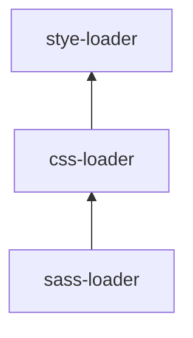

## 開発環境の準備

webpack を利用して、 SCSS を自動的に CSS に変換してくれる開発環境を作成します。ただの HTML + CSS のサイトを作成する場合、手間だと感じますが、最初にビルド設定をしておくことで開発効率をあげることができます。

### プロジェクトの作成

```bash
mkdir my-awesome-site
cd my-awesome-site
git init # オプション
npm init -y
```

### html , scss , js を用意する

`src` フォルダを作成し、その中に `index.html`, `index.js`, `index.scss` を作成します。フォルダは以下のようになります。

```bash
my-awesome-site
└── src
     ├── index.html
     ├── index.js
     └── index.scss
```

各種ファイルは以下のように入力してください。

index.html

```html
<!DOCTYPE html>
<html>
  <head> </head>
  <body>
    <div>
      <h1>hello</h1>
    </div>
    <h1>world</h1>
  </body>
</html>
```

index.js

```js
import "./index.scss";
```

index.scss

```scss
div {
  h2 {
    color: red;
  }
}
```

### webpack のインストール

```bash
npm install -D webpack webpack-cli
```

webpack を呼び出せるように `package.json` を編集します。`package.json`の`script`で書かれたコマンドは `npm run ****` で呼び出せるようになります。

```json
//package.json
{
  "scripts": {
    "build": "webpack --mode=production"
  }
}
```

webpack を実行したい場合、コマンドラインで以下のように入力します。

```
npm run build
```

ちなみに、`package.json` に記述することもなく、コマンドで以下のようにすれば webpack が実行可能です。

```bash
npx webpack
```

どちらを利用するかはお好みでどうぞ。

### 出力ファイルの指定

webpack でのビルド結果をどのフォルダに出力するかを指定します。
`webpack.config.js` に以下の設定を追記します。

```js
var path = require("path"); // ディレクトリパスを取得するときに必要

module.exports = {
  // 省略
  entry: "./src/index.js",
  output: {
    path: path.resolve(__dirname, "dist"),
    filename: "main.js"
  }
  // 省略
};
```

'dist' というフォルダに、'main.js' という JavaScript が出力されるようになりました。

### html-webpack-plugin をインストール

html と webpack で生成した javascript を自動的に結びつけるために `html-webpack-plugin` を利用します。html と javascript がリンクした結果の html が `webpack.config.js` で指定した `path` に出力されます。今回の場合、`dist` フォルダに出力されます。

```bash
npm install -D html-webpack-plugin
```

```js
//webpack.config.js
const HtmlWebpackPlugin = require("html-webpack-plugin"); //installed via npm
module.exports = {
  //
  plugins: [new HtmlWebpackPlugin({ template: "./src/index.html" })]
  //
};
```

以上の設定が済んでいる状態でビルドするには以下のコマンドを実行します。

```
npm run build
```

`dist` フォルダには `index.html` と `main.js` が生成されます。サイトを後悔する場合、`dist`フォルダ以下のものをアップロードすれば完了です。

### style-loader, css-loader, sass-loader をインストール

| 機能         | 説明                               |
| ------------ | ---------------------------------- |
| style-loader | JS から CSS を読み込めるようにする |
| css-loader   | `@import`, `url()` を解決する      |
| sass-loader  | Sass/SCSS を CSS にコンパイルする  |

```bash
npm install -D  style-loader css-loader sass-loader node-sass
```

`webpack.config.js` に設定を記述します。`sass` 拡張子、`scss` 拡張子のファイルは、各種 loader で処理されたのち、JavaScript に埋め込まれます。

```js
//webpack.config.js
module.exports = {
  module: {
    rules: [
      {
        test: /(\.s[ac]ss)$/,
        use: [
          "style-loader", // creates style nodes from JS strings
          "css-loader", // translates CSS into CommonJS
          "sass-loader" // compiles Sass to CSS, using Node Sass by default
        ]
      }
    ]
  }
};
```

loader は記述された後ろのほうから適応されます。



以上で JavaScript の中で Sass/SCSS のファイルが利用可能になりました。

### Autoprefixer をインストール

CSS で最新の機能を利用しようとした場合、どうしても ベンダープレフィックスが必要になってきます。しかし、ベンダープレフィックスはブラウザのバージョンによって必要不必要が変わってきます。さらには IE はやや特殊な挙動をするものが多い。

これらのベンダープレフィックスをつける必要があるか、ないのかといったことはプログラム側は自動的に判別してくれたほうがありがたい。

ベンダープレフィックスの例

```css
div {
  -webkit-transform: scale(2);
  -ms-transform: scale(2);
  transform: scale(2);
}
```

[Autoprefixer](https://github.com/postcss/autoprefixer) を使うと、ベンダープレフィックスを自動的に付与してくれます。そのため、コーディングに集中でき、ブラウザ間の差異に意識する必要が減ります。

webpack で Autoprefixer を使う場合、`postcss-loader` と `autoprefixer` が必要になるのでインストールします。

```
npm install -D postcss-loader autoprefixer
```

`webpack.config.js` に `postcss-loader` を利用するように追記します

```js
// webpack.config.js
module.exports = {
  // 省略
  module: {
    rules: [
      {
        test: /\.s[ca]ss$/,
        use: [
          "style-loader", // creates style nodes from JS strings
          "css-loader", // translates CSS into CommonJS
          "postcss-loader", // 追記
          "sass-loader" // compiles Sass to CSS, using Node Sass by default
        ]
      }
    ]
  }
  // 省略
};
```

`postcss-loader` の設定ファイル `postcss.config.js` を作成します。

```js
module.exports = {
  plugins: [
    require("autoprefixer")({
      grid: "autoplace" // gridレイアウトを有効にする
    })
  ]
};
```

### webpack-dev-server をインストール

webpack では開発用サーバーをローカルに建てることができます。しかもファイルを変更したら即時に反映されるライブプレビューの機能がついています。開発するときに便利なのでぜひ利用しましょう。

[weppack-dev-server](https://github.com/webpack/webpack-dev-server)

webpack-dev-server のインストール

```bash
npm install webpack-dev-server --save-dev
```

webpack-dev-server をコマンドで呼び出せるように `package.json` を編集します。

```json
{
  "scripts": {
    "build": "webpack --mode=production",
    "start:dev": "webpack-dev-server"
  }
}
```

webpack-dev-server を起動したい場合、以下のコマンドで可能です。

```bash
npm run start:dev
```

### Typescript で記述可能にする

もうここまできたら TypeScript でも記述できるようになっちゃいましょう。思いの外記事が長くなってきて、テンションがおかしい。

TypeScript には `typescript` と `ts-loader` が必要になります。

```
npm install --save-dev typescript ts-loader
```

webpack.config.js に TypeScript に関する設定を追記します。

```js
module.exports = {
  // 省略

  module: {
    rules: [
      {
        test: /\.s[ca]ss$/
        //   省略
      },
      {
        test: /\.tsx?$/,
        use: "ts-loader",
        exclude: /node_modules/
      }
    ]
  },

  resolve: {
    extensions: [".tsx", ".ts", ".js"]
  }
  //   省略
};
```

typescript をどのようにコンパイルするか `tsconfig.json`に記述します。

```json
{
  "compilerOptions": {
    "outDir": "./dist/",
    "noImplicitAny": true,
    "sourceMap": true,
    "module": "es6",
    "target": "es5",
    "jsx": "react",
    "allowJs": true
  }
}
```

### 完了

お疲れ様です。以上で環境構築が完了です。webpack.config.js は以下のようになります。

```js
var HtmlWebpackPlugin = require("html-webpack-plugin");
var path = require("path");

module.exports = {
  entry: "./src/index.js",
  output: {
    path: path.resolve(__dirname, "dist"),
    filename: "main.js"
  },

  module: {
    rules: [
      {
        test: /\.scss$/,
        use: [
          "style-loader", // creates style nodes from JS strings
          "css-loader", // translates CSS into CommonJS
          "postcss-loader", // add Autoprefixer
          "sass-loader" // compiles Sass to CSS, using Node Sass by default
        ]
      },
      {
        test: /\.tsx?$/,
        use: "ts-loader",
        exclude: /node_modules/
      }
    ]
  },
  resolve: {
    extensions: [".tsx", ".ts", ".js"]
  },

  plugins: [new HtmlWebpackPlugin({ template: "./src/index.html" })]
};
```

以上の設定をすませたお陰で、ベンダープレフィックスに悩まされることもなく、Sass/SCSS でカスタマイズ可能で、TypeScript を記述可能、更にはライブプレビューが有効になっている開発環境が構築できました。

## まとめ

webpack を利用した開発環境構築でした。

今回は以下のことを行いました。

- webpack-dev-server の導入
- Sass/SCSS の導入
- Autoprefixer の導入
- TypeScript の導入
