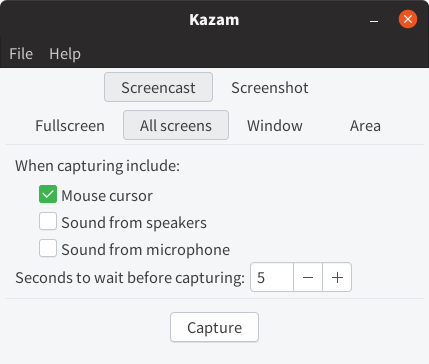

デスクトップ画面の録画は何かと便利です。操作方法を示したり、ソフトウェアのプレゼンテーションを作成したり、チュートリアルを作成するのに重宝します。

言葉だけよりも、静止画だけよりも、動きのあるムービーとして示したほうが視覚的にわかりやすいです。

今回は Ubuntu で利用できる Kazam というソフトウェアの紹介です。

## Kazam Screencaster

[Kazam](https://launchpad.net/kazam) はシンプルな操作でデスクトップ画面を録画することができるツールです。



インストールはコマンド一行ででき、導入もシンプルです。

```bash
sudo apt install kazam
```

標準で録画する形式は H264(MP4) となっています。VP8/WebM フォーマットにも対応しており、ネットにあげるための動画を録画するのにも利用できます。

GIF の録画には対応していないので、別途変換ソフトが必要になります。

## シンプルで使いやすい UI

シンプルな UI ですが、そのぶん使いやすいです。

- 1つのスクリーンを録画する「Fullscreen」
- 接続されているすべてのスクリーンを録画する「All Screen」
- 特定の Window を録画する「Window」
- 録画エリアを指定して録画する「Area」

など録画領域を簡単に切り替えることができます。
また、スピーカーの音を録音する、マイクの音を録音するといったことも、チェックボックスのオンオフで切り替えられます。

マウスカーソルの動きも録画できるため、アプリケーションの操作方法を示すのに役に立つでしょう。

## まとめ

Ubutnu の画面録画ツール Kazam についてでした。アプリケーションの動作を示すのに、役立つと思います。
