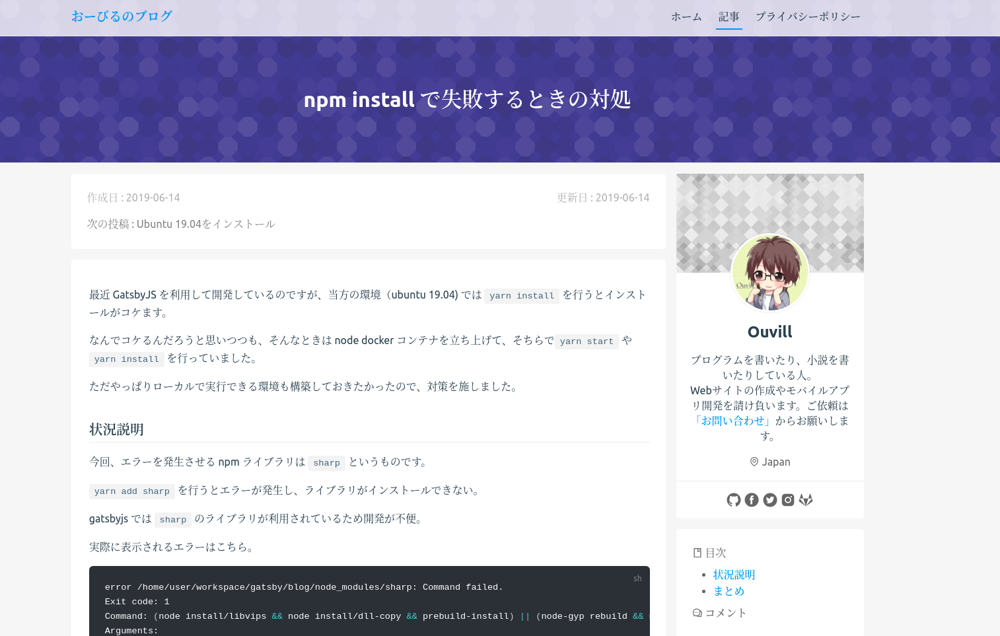
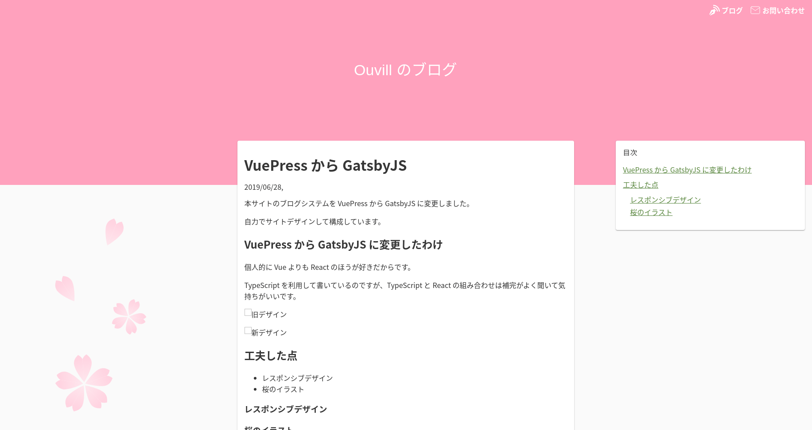

本サイトのブログシステムを VuePress から GatsbyJS に変更しました。

自力でサイトデザインして構成しています。

## VuePress から GatsbyJS に変更したわけ

個人的に Vue よりも React のほうが好きだからです。

TypeScript を利用して書いているのですが、TypeScript と React の組み合わせは補完がよく聞いて気持ちがいいです。

## 旧デザインと新デザインの比較

旧デザイン

新デザイン

旧デザインは VuePress と [vuepress-theme-meteorlxy](https://github.com/meteorlxy/vuepress-theme-meteorlxy) というテーマを利用していました。

今回は GatsbyJS と独自デザインでサイトを構築しています。

比較してみると、旧デザインよりもかなりシンプルになっていています。

今回はデザインを自作したため、すべてのサイトページのHTML,CSS, JS の構成をばっちり把握できています。

今後も自分で自由にサイトのデザイン、機能を拡張していけるのは自作のメリットだと思います。

## デザインコンセプト − 桜

今回のデザインコンセプトは桜です。作成したのは6月なのでもう夏になりかけなのですが……。

桜のアイコンイラストも今回のために自作しました。

解像度が高いディスプレイでは、画面左部分にほんのりと桜の花が表示されるようにデザインしています。

## 意識した点

### サイドバーのコンテンツを減らす

本サイトのサイドバーは目次のみとなっています。

ブログでよくあるデザインは、画面やや左寄りにメインコンテンツがあり、右端にサイドバーが配置されているものです。

ただ検索でやってきた読者にとってはサイドバーはほとんど目に入らないものです。

カテゴリーや新着記事なんかをサイドバーで表示していても、記事のコンテンツを読んでいるあいだは目に止まりません。スクロールして流されるだけです。

それならいっそのこと表示しなくていいじゃないかと思ったので、サイドバーは目次のみを表示しています。

サイドメニューにダラダラとページリンクを書くくらいならば、ページ下部に関連リンクを表示するようにしたほうが読者も利用しやすいです。
