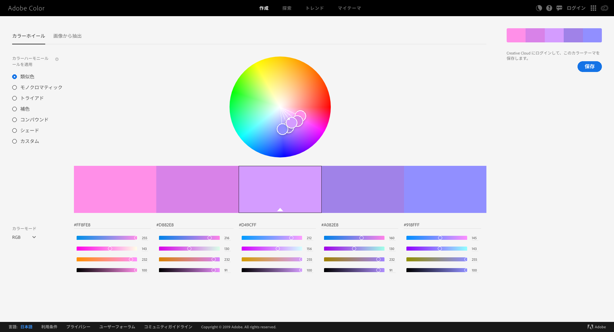
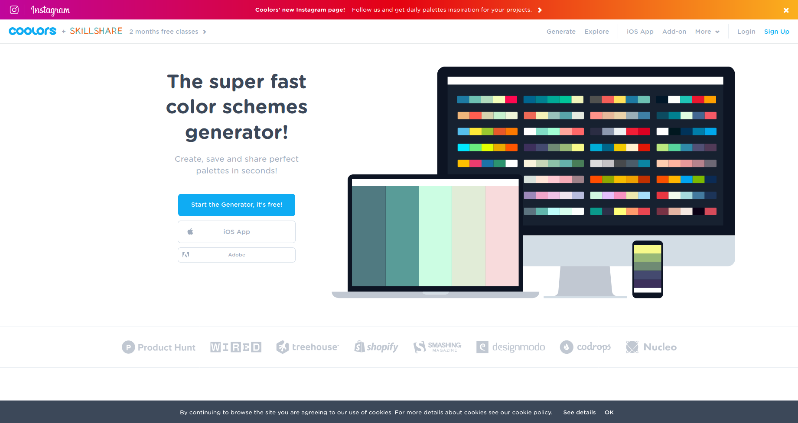
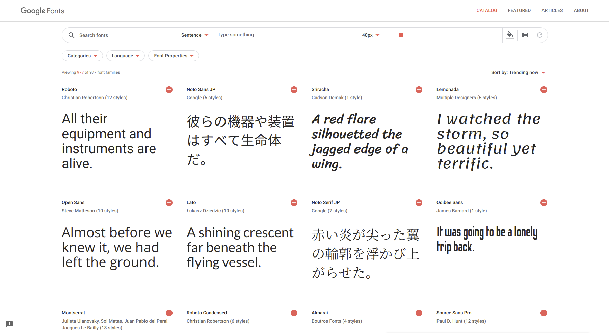
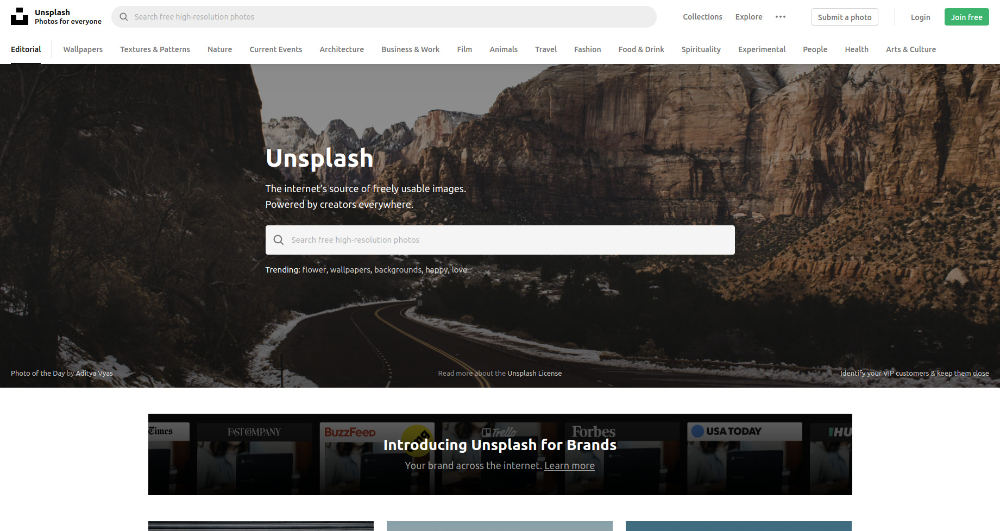
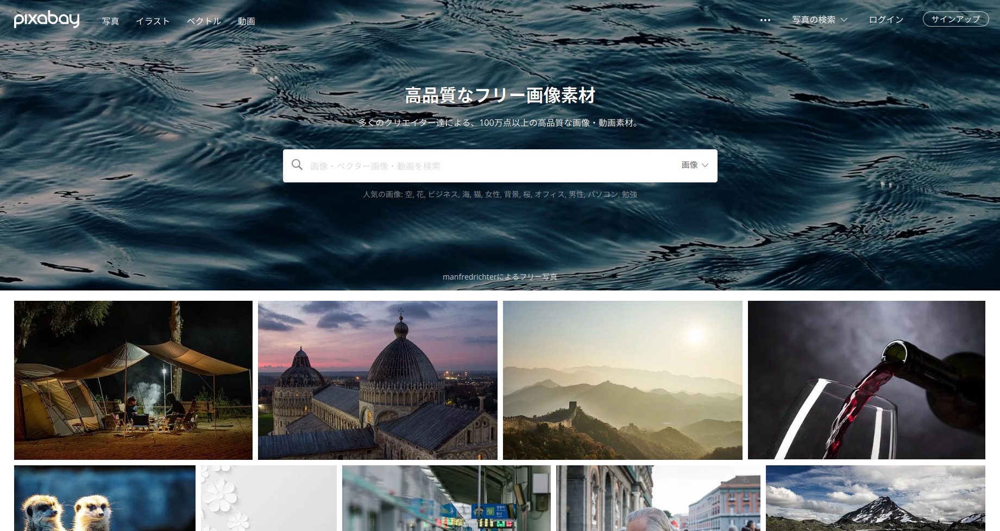
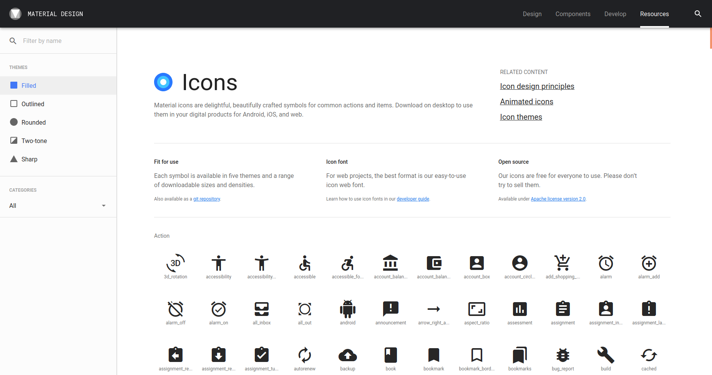
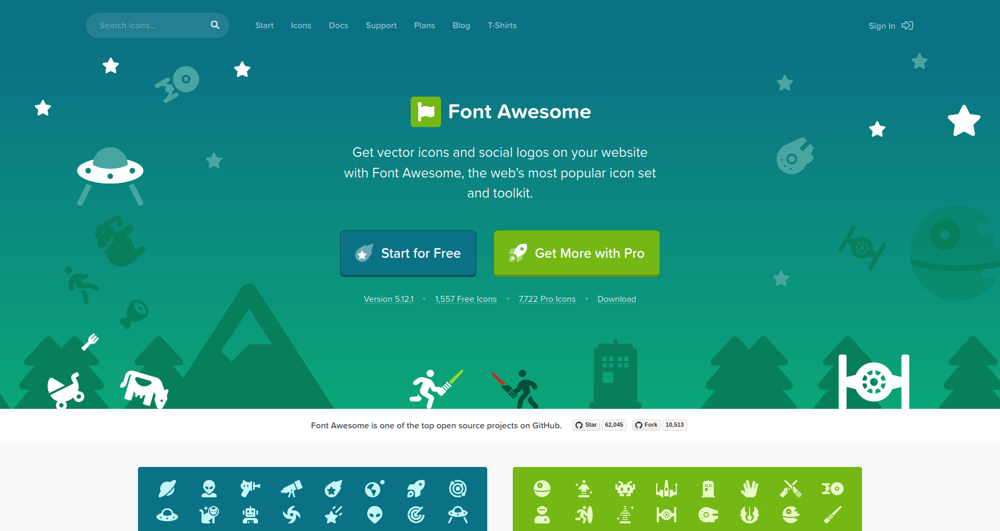
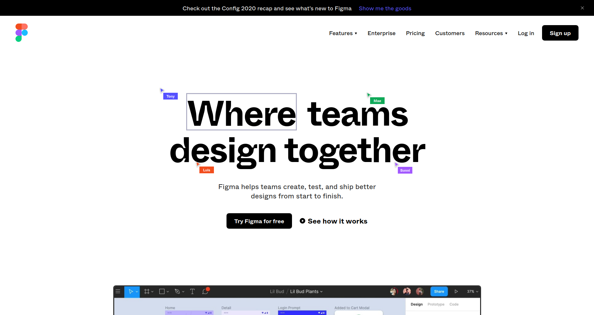

Web サイトをデザイン、作成するときに利用しているサイトをまとめます。
自分も利用しているんですが、ときどきサイト名を忘れてしまったりするので自分への備忘録としても作成します。

## 色

### Adobe Color

[Adobe Color](https://color.adobe.com/ja/create)

Adobe が提供しているカラーパレット生成サイト

- 類似色
- モノクロマティック
- トライアド
- 補色
- コンパウンド
- シェード

上記の色の組み合わせを表示できます。

### Coolors

[COOLORS](https://coolors.co)

スペースを押すたびにいい感じのカラーパレットを生成してくれる。どんな色を使ってサイトをデザインしようか迷ったら、とりあえずスペースを連打して好みのパレットが出てくるか探してみるのもいいです

## フォント

[Google Fonts](https://fonts.google.com/)

Google が提供している Web フォント。日本語フォントもいくつかあります。

Web フォントなのでサーバーにわざわざフォントをアップロードしておく必要もなく便利。

Windows, Mac, Linux, Android, iOS など使用している OS や環境によってデフォルトで用意されているフォントが異なります。フォントの見た目を統一したいのなら、Web フォントを用意しておくといいです。

注意: フォントをダウンロードするのでそのぶん通信を食います。

## 画像

かっこいい画像が欲しい時は以下のサイトから探すことが多いです。商用利用可能で使い勝手がいい。

[Unsplash](https://unsplash.com/)

[Pixabay](https://pixabay.com/ja/)

## イラスト

### unDraw

[unDraw](https://undraw.co/illustrations)

顔がなくてちょっとゆったりとしてそうな人々のイラスト。

最近こういうイラスト流行ってきていますよね。

以下のリンクにフリーで使えるイラストがまとめられています。

[Free Amazing Illustrations Library for Your Project](https://www.lapa.ninja/blog/free-illustrations-library-for-your-project/)

## アイコン

### Material Design Icon

[Material Design Icon](https://material.io/resources/icons/?style=baseline)

Google が提唱している Material Icon。シンプルな物が多い。

### Font Awesome

[Font Awesome](https://fontawesome.com/)

Web フォント形式で利用できるアイコン集。React や Vue で利用できるライブラリも公開されています。

## プロトタイピング

ブラウザで動作するプロトタイピングツール。

ブラウザで動作したり複数人数で同時編集したりできるから便利。

[figma](https://www.figma.com/)

## まとめ

デザインするとき、サイトを作成する時に利用しているサイト集でした。
