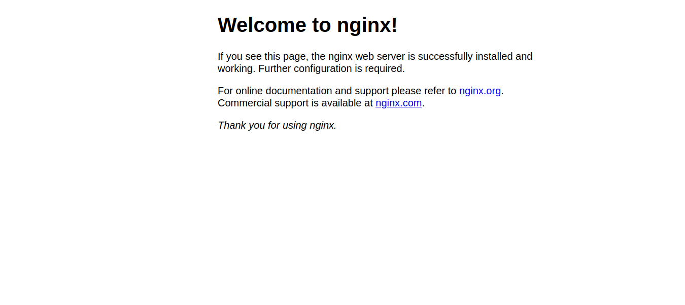

Kubernetesについて。今回はクラスターにやってきたアクセスをURLベースでアクセス制御できる`Ingress`についてです。

## Ingressとは

Ingressとは、クラスター外からクラスター内ServiceへのHTTP、HTTPSのルートを公開します。

> IngressはServiceに対して、外部疎通できるURL、負荷分散トラフィック、SSL/TLS終端の機能や、名前ベースの仮想ホスティングを提供するように設定できます。Ingressコントローラーは通常はロードバランサーを使用してIngressの機能を実現しますが、エッジルーターや、追加のフロントエンドを構成してトラフィックの処理を支援することもできます。

by [Ingressとはなにか - Ingress | Kubernetes](https://kubernetes.io/ja/docs/concepts/services-networking/ingress/#ingress%E3%81%A8%E3%81%AF%E4%BD%95%E3%81%8B)

Ingressを利用すると、クラスターにやってきたHTTPやHTTPSのリクエストを制御できます。

`http://foo.com`をPod(A)群に紐付いたService(A)に振り分けたり
`http://bar.com`をPod(B)群に紐付いたService(B)に振り分けたりできます。

また

`http://foo.com/hoge`のアクセスはPod(C)群に紐付いたService(C)に振り分けることができます。

ingressを利用すると、URLベースでコンテナのアクセスを振り分けることができるのでとても柔軟にサービスを構成することができます。

## microk8sを利用して、Ingressを利用してNginxとApacheのサイトを構成する

### 目標

ApacheとNginxのコンテナを立ち上げて、`127.0.0.1/nginx`にアクセスすると`nginx`に、`127.0.0.1/apache`にアクセスすると`apache`にルーティングされるKubernetes環境を作成します。

### 方法

#### ingressの有効化

ingressを有効化します。
Ingressはクラスターの環境によって利用できるコントローラーが異なるので、クラスターに最適なIngressコントローラーを利用してください。[Ingressコントローラー](https://kubernetes.io/ja/docs/concepts/services-networking/ingress-controllers/)一覧。
筆者は`microk8s`環境でテストを行なっています。

minikubeの場合

```
minikube addons enable ingress
```

microk8sの場合

```
microk8s enable ingress
```

### NginxのPodをデプロイする

`nginx-deployment.yml`

```
apiVersion: apps/v1
kind: Deployment
metadata:
  name: nginx
spec:
  selector:
    matchLabels:
      app: nginx
  template:
    metadata:
      labels:
        app: nginx
    spec:
      containers:
      - name: nginx
        image: nginx
        ports:
        - containerPort: 80
```

Nginxをデプロイするだけのマニュフェストファイルです。

マニュフェストファイルを適用します。

```
$ kubectl apply -f nginx-deployment.yml
```

Nginxがデプロイされていることを確認します。

```
$ kubectl get deployments nginx
NAME    READY   UP-TO-DATE   AVAILABLE   AGE
nginx   1/1     1            1           3h38m
```

### Nginxのコンテナにアクセスできるようにサービスを紐付ける

コンテナとサービスを紐づけて、通信できるようにします。Nginxに直接アクセスして動作しているか確認したいので、今回はServiceタイプをNordPortにしています。

`nginx-service.yml`

```
apiVersion: v1
kind: Service
metadata:
  name: nginx-service
spec:
  type: NodePort
  selector:
    app: nginx
  ports:
  - port: 80
    targetPort: 80
```

マニュフェストファイルを適用します

```
$ kubectl apply -f nginx-service.yml 
```

サービスがデプロイされたか確認します。

```
$ kubectl get services nginx-service
NAME            TYPE       CLUSTER-IP      EXTERNAL-IP   PORT(S)        AGE
nginx-service   NodePort   10.152.183.65   <none>        80:32596/TCP   103s
```

自分の環境ではクラスターのポート`32596`に紐付けられたので、ブラウザでアクセスしてみます。

もしローカルで動かしているのなら`127.0.0.1:{port}`でアクセスできます。




### Apacheのコンテナをデプロイ

Nginxのコンテナと同様にApacheのコンテナをデプロイします。

`apache-deployment.yml`

```
apiVersion: apps/v1
kind: Deployment
metadata:
  name: apache
spec:
  selector:
    matchLabels:
      app: apache
  template:
    metadata:
      labels:
        app: apache
    spec:
      containers:
      - name: apache
        image: httpd
        resources:
          limits:
            memory: "128Mi"
            cpu: "500m"
        ports:
        - containerPort: 80
```

マニュフェストファイルを適用します

```
$ kubectl apply -f apache-deployment.yml
```

デプロイされたか確認します

```
$ kubectl get deployments apache
```

### Apacheのコンテナにアクセスできるようにサービスを紐付ける

Nginxのときと同様にServiceとPodを紐づけます。

`apache-service.yml`

```
apiVersion: v1
kind: Service
metadata:
  name: apache-service
spec:
  type: NodePort
  selector:
    app: apache
  ports:
  - port: 80
    targetPort: 80
```

マニュフェストファイルを適応

```
$ kubectl apply -f apache-service.yml
```

サービスがデプロイされたか確認します。

```
$ kubectl get service apache-service
NAME             TYPE       CLUSTER-IP       EXTERNAL-IP   PORT(S)        AGE
apache-service   NodePort   10.152.183.229   <none>        80:31144/TCP   27m
```

今回の場合、クラスターのポート`31144`にアクセスするとApacheが動いていることを確認できます。

もしローカルで動かしているのなら`127.0.0.1:{port}`でアクセスできます。


### Ingressの設定

Ingressは有効にしましたか？

minikubeの場合

```
minikube addons enable ingress
```

microk8sの場合

```
microk8s enable ingress
```

おさらいですが、上記コマンドで有効にできます。

それではIngressの設定を行なっていきます。

`sample-ingress.yml`

```
apiVersion: networking.k8s.io/v1
kind: Ingress
metadata:
  name: sample-ingress
  labels:
      name: sample-ingress
  annotations:
    nginx.ingress.kubernetes.io/rewrite-target: /$2
spec:
  rules:
  - http:
      paths:
      - path: /nginx
        pathType: Prefix
        backend:
          service:
            name: nginx-service
            port:
              number: 80
      - path: /nginx/apache
        pathType: Prefix
        backend:
          service:
            name: apache-service
            port:
              number: 80

```

`/nginx`のアクセスは`backend`に指定されたサービス、`nginx-service`の80ポートに転送され、`/apache`のアクセスは`backend`に指定されたサービス、`apache-service`の80ポートに転送されるように設定しています。

```
$ kubectl apply -f sample-ingress.yml
```

Ingressによってクラスターに来たHTTP(port 80)やHTTPS(port 443)通信は、ルーティングされるようになります。

`127.0.0.1/nginx`で`nginx`に、`127.0.0.1/apache`で`apache`にアクセスできることが確認できると思います。

### お掃除

作成した`deployment`や`service`,`ingress`は以下のコマンドで削除できます。

```
$ kubectl delete -f {ファイル名}
```

もし以下のように同じフォルダーに保存していたのなら、

```
sample/
├── apache-deployment.yml
├── apache-service.yml
├── nginx-deployment.yml
├── nginx-service.yml
└── sample-ingress.yml
```

```
$ kubectl delete -f {フォルダ}
```

上記で一括に削除できます。

## 参考

[Ingress | Kubernetes](https://kubernetes.io/ja/docs/concepts/services-networking/ingress/)
[](https://kubernetes.github.io/ingress-nginx/)
