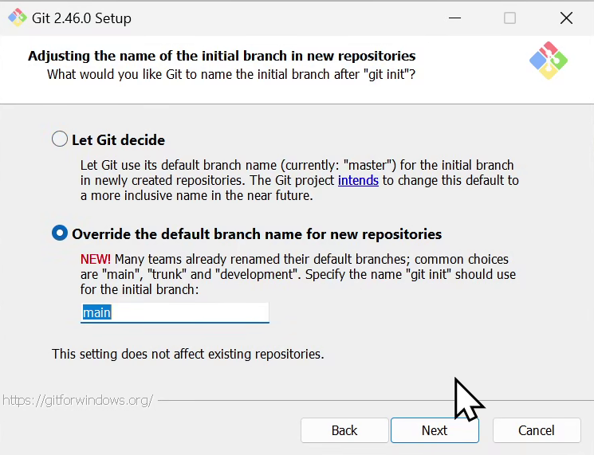
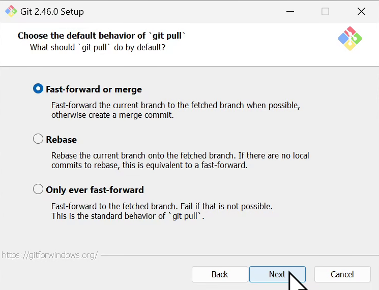

WindowsのGitのインストール、難しくないですか？

インストーラーで聞かれることが多すぎて、何を選択すればいいのかわからなくなりがちだと思います。

インストール方法、設定方法を解説します。

## Gitのダウンロード

Gitのページにアクセスします。Download for Windowsをクリックします。

ダウンロードページに移動するので、`Click here to download manually`をクリックします。

## Gitのインストール

ダウンロードフォルダにダウンロードされたインストーラーをダブルクリックして実行します。

インストーラーを起動すると以下の画面が表示されます。

ライセンス表示です。ライセンスを読んで同意するかどうかを選択します。

どこにインストールするのかを選択します。基本的にデフォルトのままで問題ありません。

スタートメニューのショートカットを作成するかどうかを選択します。デフォルトのままで問題ありません。

Gitで利用するエディタを選択します。デフォルトの設定のままではVimが選択されています。Vimはキーバインドが特殊で慣れていないと使いにくいです。Visual Studio Codeを選択するのがおすすめです。

Visual Studio Codeを選択してインストールを進めます。

Gitのデフォルトのブランチの名前を選択します。Gitのデフォルトブランチは`master`が採用されていました。しかし、`master`は差別的な言葉であるとして、`main`に変更する動きが広がっています。`main`を選択するのがおすすめです。

mainに変更してインストールを進めます。

Gitを環境変数のPATHに追加するかを選択します。デフォルトのままで問題ありません。

Gitは通信にOpenSSHを利用します。Gitに同梱されているOpenSSHを利用するか、システムのOpenSSHを利用するかを選択します。デフォルトのままで問題ありません。

Gitは通信にSSL/TLSをを利用します。Gitに同梱されているOpenSSLを利用するか、Windowsのものを利用するかを選択します。デフォルトのままで問題ありません。

ただし、企業管理のパソコンの場合は、Windows Secure Channelを選択したほうが楽でしょう。

改行コードを自動で変換するかを選択します。歴史的にWindowsの改行コードはCRLF、Linux, Macの改行コードはLFでした。

ソフトウェア開発では改行コードをLFに統一することが多いです。デフォルトの設定ではGitに変更を記録するときはLFで保存して、WindowsでチェックアウトするときはCRLFに変換するようになっています。

WindowsでもLFの改行コードが扱えるようになっているので、チェックアウトするときにCRLFに変換するのは不要になっています。個人的には真ん中の`Checkout as-is, commit as-is`を選択するのがおすすめです。

Gitの端末エミュレーターを選択します。デフォルトのままで問題ありません。

`git pull`の挙動を選択します。デフォルトのままで問題ありません。

Git Credential Helperを選択します。デフォルトのままで問題ありません。`https`のリポジトリにアクセスする時、ユーザー名とパスワードを入力する必要があるのですが、これによってユーザー名とパスワードを端末に保存し入力を省略します。

追加のオプションを選択します。デフォルトのままで問題ありません。

実験的機能の有効化を選択します。最新の機能を試したい、Gitの開発に貢献したい場合のみ有効化しましょう。基本はチェックを入れずデフォルトのままで問題ありません。

以上でインストールが完了しました。おつかれさまでした。

